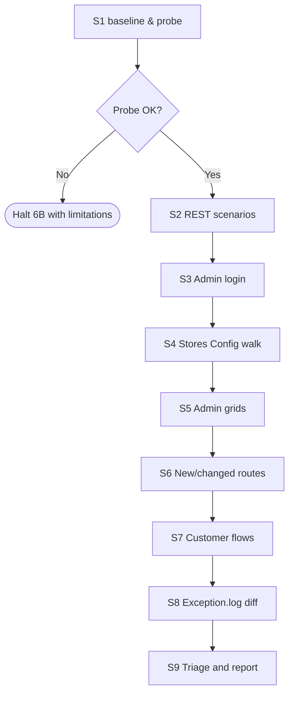

# Smoke Runner

How Phase 6B actually executes — environment probe, REST invocation, browser driving, and
graceful fallbacks. This file is the **only** source of truth for the smoke runner; do not
hardcode runner choices in `SKILL.md`.

---

## 1. Environment Probe (S1)

Run once at the start of Phase 6B. Record every result in `.docs/{FeatureName}/smoke/baseline.txt`.
Never assume a tool exists; degrade explicitly.

| Probe | How to detect | If missing |
|-------|---------------|------------|
| Base URL | `CLAUDE.md` line `Base URL:` → else `{magento} config:show web/secure/base_url` → else ask | Halt 6B with "no base URL — smoke cannot run". |
| Admin URL fragment | `{runner} php -r "echo (require 'app/etc/env.php')['backend']['frontName'] ?? 'admin';"` | Default `/admin` and warn. |
| Admin user | `CLAUDE.md` line `Smoke admin user:` → else env `M2_SMOKE_ADMIN_USER` → else prompt once | Halt S3 only; other suites continue. |
| Admin password | `CLAUDE.md` line `Smoke admin pass:` → else env `M2_SMOKE_ADMIN_PASS` → else prompt once (echo suppressed) | Halt S3 only. |
| HTTP client | `curl --version` → fallback `{runner} php -r "echo function_exists('curl_init') ? 'php' : 'no';"` | Skip S2; record explicit limitation. |
| Headless browser | `npx --no-install playwright --version` → fallback `npx --no-install puppeteer --version` → fallback `google-chrome --version` (raw CDP mode) | Skip S3–S7; record explicit limitation. |
| Node | `node --version` | Skip browser-dependent suites. |
| jq | `jq --version` | Optional — fall back to raw JSON in report. |

`google-chrome` is the lowest-common-denominator fallback. The repository's `scripts/smoke-browser.mjs`
implements all three paths and picks the first available at startup.

### Production guard

After resolving `Base URL`, run the production heuristic from `smoke-test-guide.md` §Data Hygiene.
If the URL looks like production AND `CLAUDE.md` does **not** contain
`Allow smoke on production: true`, halt 6B with:

> Base URL `{url}` looks like production. Smoke runs create and delete data; refusing to run.
> To override, add `Allow smoke on production: true` to CLAUDE.md.

---

## 2. REST Invocation (S2)

For each REST scenario in `scenarios.md`, the runner:

1. Resolves an auth token according to the scenario's `Auth` column:
   - `admin token` → POST `/V1/integration/admin/token` with admin user/pass; cache token for the run.
   - `customer token` → POST `/V1/integration/customer/token` with the throwaway customer
     created in S7. If S7 has not run yet, create the customer inline as part of S2 prep.
   - `none` → no Authorization header.
   - `wrong ACL` → use the customer token (or an integration token with no admin ACL).
2. Builds the request: method + URL (`{base}/rest{route}`) + body (read from scenarios.md sample).
3. Executes via `curl --silent --show-error --include` (or PHP cURL fallback).
4. Parses status line and body; matches against the scenario's `Expect status` + `Expect body match`
   (the latter is a JSONPath-style expression; jq is preferred when available, regex fallback otherwise).
5. Writes the actual status into the `Actual` column and pass/fail into the `Pass` column.
6. Stores the raw request/response under `smoke/raw/S2/{scenario-id}.txt` so failures are debuggable.

Auth tokens are stored only in memory; never written to baseline.txt or any file.

---

## 3. Browser Driving (S3–S7)

The runner uses `scripts/smoke-browser.mjs` — a thin wrapper around Playwright/Puppeteer/raw-CDP.
It exposes one command per suite step:

```bash
node scripts/smoke-browser.mjs <command> [options]
```

| Command | Purpose | Output |
|---------|---------|--------|
| `admin-login --url=… --user=… --pass=…` | Drive S3 | `{ ok, status, consoleErrors[], screenshot }` JSON to stdout |
| `stores-config-walk --url=… --token=… --sections=a/b/c,d/e/f` | Drive S4 | per-section result |
| `grid --url=… --route=/admin/customer/index/index --filter='name:Smith'` | Drive S5 per grid | row count, filter applied/cleared |
| `visit --url=… --route=/path --click=#cta --screenshot=out.png` | Drive S6 per route | render status, console errors |
| `customer-flow --url=… --email=smoke+{uuid}@example.test --pass=…` | Drive S7 | each step result |
| `cleanup --url=… --customer-email=…` | S9 cleanup | deletion confirmation |

The wrapper:

- Captures `page.on('console')` errors (`error` and `pageerror` only — `warn`/`info` ignored).
- Captures any HTTP response with status >= 500 as a Critical finding.
- Captures uncaught JS exceptions as High findings.
- Saves a screenshot per command to `smoke/screenshots/run-{N}/{slug}.png`.
- Times out at 30s per page navigation; surfaces a finding rather than retrying silently.

### Tool selection at startup

```
if (npx playwright is available)        → Playwright (chromium, headless)
else if (npx puppeteer is available)    → Puppeteer
else if (google-chrome is available)    → raw CDP over a spawned `google-chrome --headless --remote-debugging-port=...`
else                                    → exit 78 (unavailable); skill marks browser suites as skipped
```

Exit codes: `0` = pass, `1` = at least one finding, `78` = tool unavailable.

---

## 4. Exception Log Diff (S8)

Implemented by `scripts/smoke-baseline.sh` (S1) and `scripts/smoke-tail-since.sh` (S8). Operates
on byte offset, not line count, so concurrent writes are detected even if the file rotated.

S1 produces `smoke/baseline.txt`:

```
file=src/var/log/exception.log
size_bytes=12834
sha256_of_last_4096=ef9c...
captured_at=2026-05-28T10:14:22Z
```

S8 reads `smoke/baseline.txt`, locates the file (handles rotation: if size decreased or sha mismatch
of the original tail region, the file rotated — re-read from byte 0 and treat the entire content as
"new since baseline"), and writes the diff to `smoke/raw/S8/exception-diff.log`.

Any non-empty diff is a finding. Categorisation: each new line becomes one finding with severity
**Critical** by default; the runner pattern-matches against known noise (e.g. cron heartbeat that
the user explicitly allowlisted in `CLAUDE.md` via `Smoke exception ignore: ^Cron .* heartbeat$`)
and demotes matched lines to Medium.

The baseline file persists across iterations within the same run, so iteration 2's S8 still
diffs against iteration 1's S1 baseline — i.e. exception lines created by iteration 1's fix
attempts are not "forgiven". This is intentional.

---

## 5. Runner Composition



Suites S2–S7 run sequentially (not parallel) — they share auth state and would race on the
exception log baseline. Within a suite, individual scenarios may parallelise as long as the
runner script supports it; the default browser wrapper runs serially for predictability.

---

## 6. Failure handling inside the runner

The runner does **not** retry on its own. A first failure is recorded and the next suite continues
so the user sees the full damage in one report. The skill — not the runner — decides whether the
overall iteration is a pass.

Two exceptions:

- Auth token requests in S2 may retry once on network timeout (Magento token endpoints are
  occasionally slow on cold start).
- Browser navigation may retry once on `net::ERR_CONNECTION_REFUSED` after a 5s wait (gives a
  just-deployed PHP-FPM time to warm up).

Both retries are logged in the run report so a flaky environment is visible.
