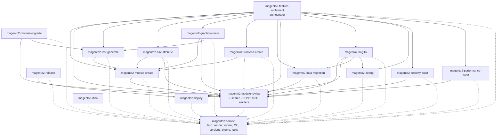
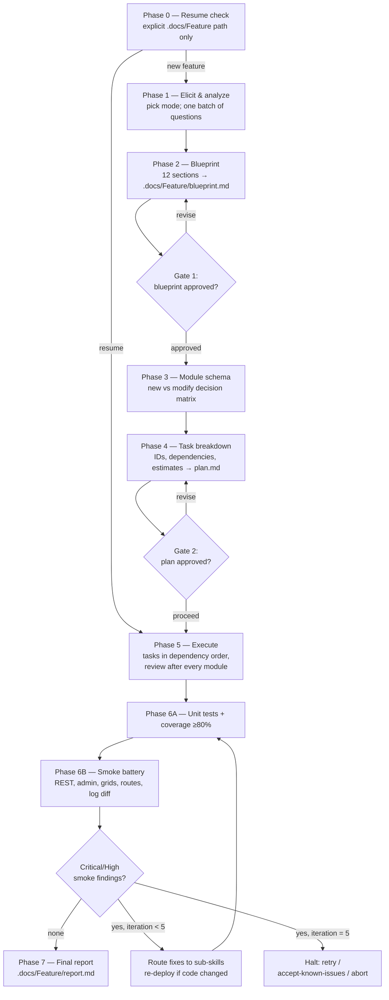
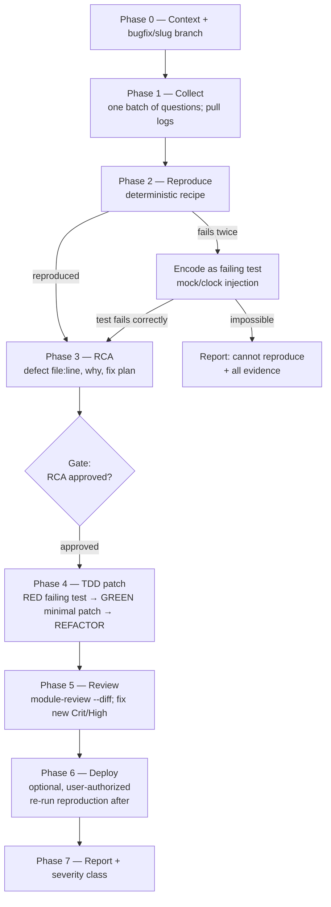
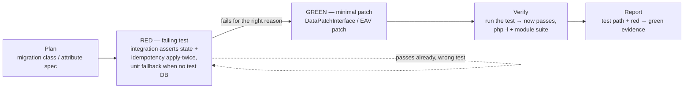
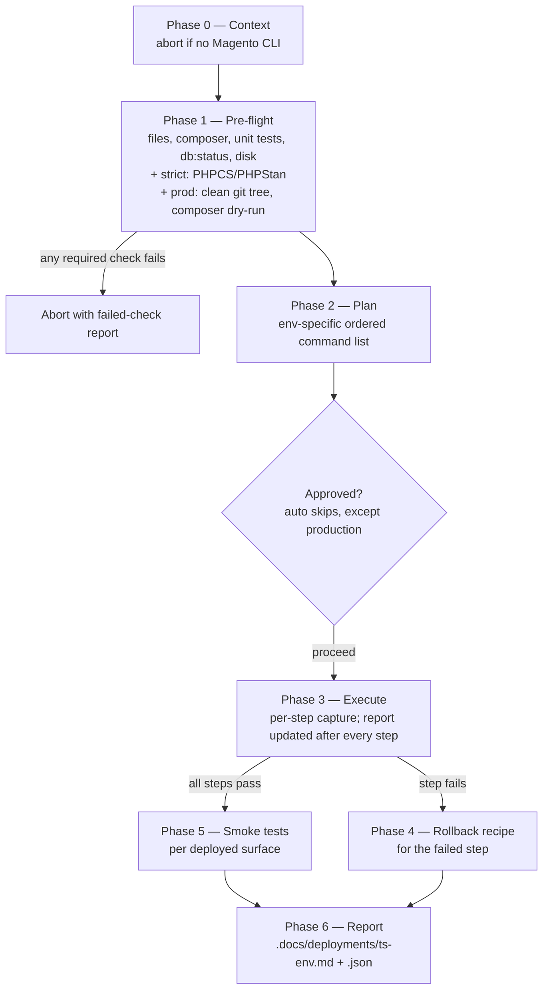
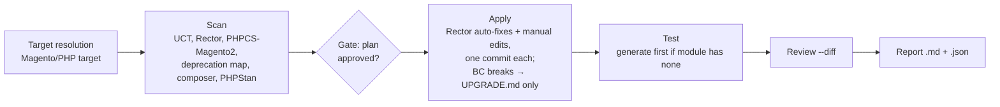
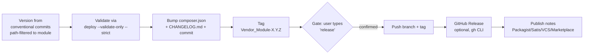
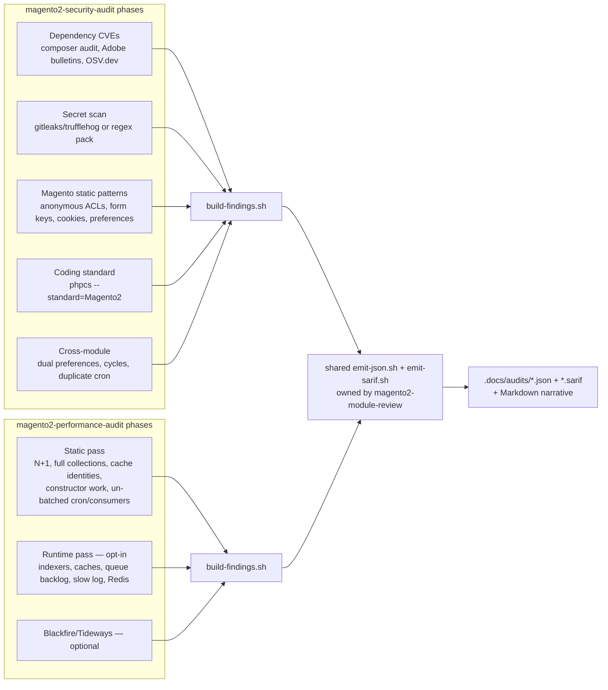

# Flows and scenarios

A full observation of how the toolkit's skills work and work together: the
architecture, each major flow phase-by-phase, the approval-gate map, the artifact map,
and end-to-end scenario walkthroughs.

## Architecture: hub and spoke

`magento2-context` is the universal leaf — every other skill resolves environment
questions through it, and it depends on nothing. `magento2-feature-implement` is the
top orchestrator. `magento2-module-review` owns the shared findings emitters
(JSON/SARIF) that the audit skills reuse.



Dotted edges: context resolution (all skills). Solid edges: workflow delegation.

### Shared infrastructure

Four pieces keep the 17 skills consistent:

1. **The context document.** One JSON object (cached at
   `.claude/.cache/magento2-context.json`) holding vendor, layout, edition, versions,
   the runner prefix, the Magento CLI command, theme, and tool paths. Skills consume
   `{ctx.*}` values and never re-resolve them independently. Missing tools are `null` —
   honest gaps, never invented paths.
2. **The findings schema and severity scale.**
   `skills/magento2-context/references/findings-schema.md` and
   `skills/magento2-context/references/severity.md` define
   one finding shape and one Critical/High/Medium/Low/Info scale. Review, security
   audit, performance audit, and module upgrade all emit it, through the shared
   `emit-json.sh` / `emit-sarif.sh` scripts owned by `magento2-module-review`.
3. **The `.docs/` artifact convention.** Every skill writes its durable outputs to a
   predictable folder in *your* project (see [artifact map](#artifact-map)).
4. **Naming and placeholders.** `skills/magento2-context/references/naming.md` is the
   single naming authority; templates share a placeholder registry enforced by the
   repo's contract tests.
5. **The test-first discipline.**
   `skills/magento2-context/references/tdd-discipline.md` defines one red → green →
   refactor loop and the **behaviour/boilerplate line** (what is written test-first vs.
   exempt scaffold/config), plus the interface-first seam and a tiered fallback for when
   no test DB is available. It is consumed by `magento2-bug-fix` (always), by
   `magento2-feature-implement` under TDD mode, and by `magento2-data-migration` and
   `magento2-eav-attribute` (test-first by default for the data/attribute effect).

---

## Feature implementation flow

`magento2-feature-implement` — the orchestrator. Seven phases, two approval gates, one
bounded smoke loop.



**Modes** (chosen in Phase 1): `feature` (full pipeline), `hotfix` and `extend` (skip
Phases 3–4; only the blueprint gate), `spike` (reduced Phases 6–7, findings logged at
Info).

**Task types executed in Phase 5:** `M*` create module (→ `magento2-module-create`),
`X*` modify existing, `R*` review (→ `magento2-module-review --diff`; Critical/High
fixed before the next task), `T*` tests (→ `magento2-test-generate`), `E*` EAV
attribute (→ `magento2-eav-attribute`), `G*` GraphQL (→ `magento2-graphql-create`),
`V*` validate (PHPCS + PHPMD + PHPStan L8 + PHPUnit), `D*` deploy
(→ `magento2-deploy`), `S*` smoke suites.

**Test-first (TDD mode, opt-in):** with `--tdd` (or `Feature implement: tdd = on` /
`MAGENTO2_FI_TDD=1`; default off, `spike` exempt), Phase 5 implements behaviour-bearing
`M*`/`X*` classes test-first — scaffold the signature, write the failing test from the
task's acceptance criteria, watch it fail for the right reason, then fill the minimal
body to green. The `T*` task then becomes a coverage top-up (via `magento2-test-generate`
on exempt/boilerplate classes) rather than the first author of behaviour tests. Pure
scaffold/config (registration, DI, `module.xml`, plain DTOs, `db_schema`) stays
generated-then-covered. See `magento2-context/references/tdd-discipline.md`.

**Smoke fix routing (S9):** new `exception.log` groups are triaged by
`magento2-debug`, defects go to `magento2-bug-fix`, slow pages/N+1 to
`magento2-performance-audit`, ACL/CSRF/escaping regressions to
`magento2-security-audit`, JS/asset regressions to `magento2-frontend-create`,
schema/data-patch regressions to `magento2-data-migration`. After any code fix the
modules are re-deployed and the loop re-enters at 6A (so unit tests are re-validated
too).

**Resumability:** `plan.md` holds the Mermaid diagrams plus a Current State checkbox
list; each completed task is checked off immediately. An explicit *"resume
./.docs/{FeatureName}"* jumps straight to the first unchecked task — approvals are not
re-asked. Blueprint `Status:` transitions: `Awaiting Approval` → `Approved` →
`In Progress` → `Complete`.

---

## Bug-fix flow

`magento2-bug-fix` — surgical remediation, TDD-first, one gate.



Invariants: minimal diff; no scope expansion (extra bugs found → filed separately);
regression test required (waivers only for provably-untestable bugs or pure-config
changes validated by XSD, both recorded in the RCA and user-confirmed); `vendor/` never
edited; per-phase `[bug-fix]` commits on the bugfix branch; the skill never pushes.

Redirects: schema changes → `magento2-feature-implement --mode=extend`; data repairs →
idempotent patch via `magento2-data-migration` (stays in-skill); hard-to-reproduce
investigation → `magento2-debug`.

The red → green → refactor loop bug-fix applies is the shared
`magento2-context/references/tdd-discipline.md` — the same discipline the test-first
builders below use.

---

## Test-first builders (data-migration, eav-attribute)

Two builder skills are **test-first by default** (no flag needed): the test for the
data/attribute effect is written and watched to fail before the patch that satisfies it.



- **`magento2-data-migration`** (Phase 2 *Test First, then Generate*): the integration
  test asserts post-migration state **and idempotency** (apply twice → identical rows, no
  duplicates, no error). Idempotency is the skill's headline guarantee, so it is pinned by
  a test rather than by inspection.
- **`magento2-eav-attribute`** (Phase 3 *Test First, then Generate*): the integration test
  asserts the attribute exists after the patch with the declared **scope** (`is_global`),
  `frontend_input`, and backend/source wiring, plus idempotency; behavioural source/backend
  models get a test-first unit test.
- **Tiered fallback:** when no Magento test DB is available, both degrade honestly — a
  test-first *unit* test of the idempotency guard / behavioural model, with the integration
  gap recorded in the report — rather than skipping the discipline.

These complement, not replace, `magento2-test-generate`, which remains the backfiller for
modules whose code already exists (including ones with no tests at all).

---

## Deploy flow

`magento2-deploy` — validate, plan, execute, smoke, report; rollback by recipe.



Environment plans: local/staging run `module:status` → `module:enable` →
`setup:upgrade` → whitelist generation → `cache:flush` → `indexer:status`. Production
wraps that in `maintenance:enable`/`disable` and adds `setup:di:compile`,
`setup:static-content:deploy -f`, selective `indexer:reindex`, and consumer starts.

The critical caveat: **`setup:upgrade` rollback is lossy without a DB backup** —
applied data patches stay applied and declarative-schema drops destroy data. The
snapshot script supports `--include-db` (mysqldump) precisely for this. Smoke failures
after a completed deploy do *not* auto-rollback; they are reported for investigation.

`--validate-only` stops after Phase 2 with an exit code — the building block
`magento2-release` and CI pipelines use.

---

## Module upgrade flow

`magento2-module-upgrade` — the change list is *derived from scanners*, not described
by the user.



Findings are classified `auto-fixable` / `manual-fixable` / `bc-break`. BC breaks are
**documented, not silently fixed** (callers must be warned via the module's
`UPGRADE.md`) unless you opt in with `--include-bc-breaks`. `--scan-only` gives you the
report with zero edits.

---

## Release flow

`magento2-release` — semver from commits, gated push.



Guards: downgrade/equal `--version` overrides are refused; validation must pass before
any file changes; pushing requires the literal confirmation word; branch protection is
respected.

---

## Audit pipeline (security + performance)

Both audits share one output pipeline: scanners → `build-findings.sh` → shared
`emit-json.sh` + `emit-sarif.sh` → Markdown narrative written by the skill.



Severity is calibrated against the shared scale with domain anchors — e.g. a committed
secret or RCE-class CVE is Critical; an N+1 in checkout totals is High; an indexer in
update-on-save mode is Info. PCI-scope-elevating or PII-exposing findings are bumped to
Critical/High by default. Skipped scanners and `scanner_errors` are reported, never
silently dropped.

---

## Approval-gate map

Where each skill stops and waits for you:

| Skill | Gate(s) | What unlocks it |
|-------|---------|-----------------|
| `magento2-feature-implement` | Blueprint (Phase 2); task plan (Phase 4); smoke-loop halt at 5 iterations | "proceed" / "approved"; halt: `retry` / `accept-known-issues <IDs>` / `abort` |
| `magento2-bug-fix` | RCA before any production-code change | "proceed" / "approved" |
| `magento2-module-create` | Module profile confirm (multi-surface); full plan confirm at ≥3 surfaces or ≥20 files; parallel creation always opt-in | confirmation |
| `magento2-test-generate` | Test plan before generation | "proceed" |
| `magento2-eav-attribute` | File plan before generation | "proceed" |
| `magento2-graphql-create` | Schema + resolver plan | approval |
| `magento2-module-upgrade` | Scan report before applying (skipped by `--auto-fix`) | "proceed" |
| `magento2-deploy` | Plan before execution (skipped by `--auto`, never on production); production interactive confirm; prod snapshot prompt | "proceed"; `--i-know-what-im-doing` for auto+prod |
| `magento2-release` | Push/tag | literally typing `release` |
| `magento2-module-review`, `magento2-debug`, audits, `magento2-i18n` | none — read-only or additive-report skills | — |

---

## Artifact map

Everything durable lands under `.docs/` in your project:

```
.docs/
├── {FeatureName}/                      # feature-implement: blueprint.md, plan.md,
│   ├── blueprint.md                    #   tasks.md or tasks/, report.md,
│   ├── plan.md                         #   guides/*.html, user-docs/*.html, spec.md
│   └── ...
├── bug-fixes/{slug}/                   # bug-fix: collect.md, reproduction.md, rca.md, report.md
├── deployments/{ts}-{env}.md|.json     # deploy reports (+ .snapshot.tar.gz)
├── reviews/{Module}-review-{date}.json # module-review JSON (+ .sarif)
├── audits/security-{scope}-{date}.*    # security audit .md/.json/.sarif
├── audits/perf-{scope}-{date}.*        # performance audit .md/.json/.sarif
├── upgrades/{Module}-{from}-to-{to}-{date}.md|.json
├── tests/{Module}-coverage-{date}.md   # test-generate coverage report
├── eav-attributes/{Module}-{code}-{date}.md
├── migrations/{name}-{date}.md
├── i18n/{Module}-{date}.md
├── debug/{mode}-{date}.md              # only with --save
└── releases/{Module}-{Version}.md      # release notes
```

Code artifacts go where Magento expects them: modules under
`{magento_root}/app/code/{Vendor}/`, themes under `app/design/frontend/{Vendor}/`,
tests under each module's `Test/` tree, translations under each module's `i18n/`.

---

## End-to-end scenarios

### Scenario 1 — New feature: "store pickup notes"

> *"Customers should be able to leave a pickup note at checkout; admins see it on the
> order grid."*

1. `magento2-feature-implement` picks `feature` mode, asks one batch of questions
   (which checkout? REST or GraphQL exposure? Hyva or Luma?), writes the blueprint.
   **You approve it.**
2. Module schema: one new module `Acme_PickupNotes` (surfaces: persistence,
   service_contracts, frontend_ui, admin_ui) + a modification to the order grid.
3. Task plan: `M1` create module, `R1` review, `E1` (none), `X1` grid column, `R2`,
   `T1` tests, `V1` validate, `D1` deploy local, `S1`/`S8` + checkout/admin smoke
   suites. **You approve.**
4. Execution: module created (every file review-clean on creation), reviewed, grid
   change applied and lint-checked, tests generated and passing, PHPCS/PHPStan/PHPUnit
   green, deployed via `magento2-deploy`. *(With `--tdd` on, the service/observer
   behaviour is written test-first instead — failing test from the acceptance criteria,
   then the minimal body — and `T1` only tops up coverage on the boilerplate.)*
5. Smoke: REST scenario places an order with a note; admin grid renders; checkout flow
   completes; `exception.log` diff is clean. Suppose the grid 500s — the finding is
   triaged by `magento2-debug`, fixed by `magento2-bug-fix`, re-deployed, and the loop
   re-runs from unit tests. Bounded at 5 iterations.
6. Final report in `.docs/PickupNotes/report.md`, plus an admin user guide in HTML.

### Scenario 2 — Production incident: checkout 500

> *"Since yesterday's deploy, some checkouts fail with a 500."*

1. Triage read-only: `/magento2-tools:magento2-debug logs --since=24h
   --pattern=checkout` groups the exceptions; `trace --method='…\QuoteManagement::placeOrder'`
   shows which plugin intercepts it.
2. `magento2-bug-fix "checkout 500 — TypeError in Acme_GiftWrap plugin"` collects,
   reproduces (REST recipe), writes the RCA pointing at yesterday's commit. **You
   approve.**
3. Failing regression test → minimal patch → suite green → `--diff` review →
   `magento2-deploy --env=production --snapshot` (interactive confirm + DB-inclusive
   snapshot) → reproduction recipe re-run against production passes.
4. `.docs/bug-fixes/checkout-500-giftwrap/` holds the full audit trail.

### Scenario 3 — Pre-launch hardening

1. `/magento2-tools:magento2-security-audit --scope=site` — CVEs, secrets, anonymous
   endpoints, cross-module collisions. SARIF goes to Code Scanning.
2. `/magento2-tools:magento2-performance-audit --runtime --scope=site` — static N+1 and
   caching findings plus live indexer/queue/cache/slow-log checks.
3. Remediation routes out per finding: dependency CVEs → `magento2-module-upgrade`,
   code defects → `magento2-bug-fix`, each ending in a `--diff` review.
4. Re-run both audits; diff the JSON artifacts to show the trend.

### Scenario 4 — Platform upgrade to Magento 2.4.7

1. Per module: `/magento2-tools:magento2-module-upgrade --scan-only --to-magento=2.4.7
   Acme_Checkout` — classified findings, zero edits.
2. After reading the reports: re-run without `--scan-only`. **Approve the plan.**
   Rector auto-fixes commit per rule set; manual fixes commit per change; BC breaks are
   written to each module's `UPGRADE.md` for consumers.
3. Tests run (generated first for uncovered modules), `--diff` review passes,
   per-module reports land in `.docs/upgrades/`.
4. Deploy to staging via `magento2-deploy --env=staging --strict`.

### Scenario 5 — Release day

1. `/magento2-tools:magento2-release Acme_OrderExport` — commits since
   `Acme_OrderExport-1.3.0` contain two `fix:` and one `feat:` → proposes `1.4.0`.
2. Pre-flight validation passes (`deploy --validate-only --strict`).
3. CHANGELOG and composer.json bumped; tag `Acme_OrderExport-1.4.0` created.
4. You type `release` → branch + tag pushed → GitHub Release created from the generated
   notes in `.docs/releases/OrderExport-1.4.0.md`.

### Scenario 6 — New developer, existing project

Day one for a developer joining a project that already uses the toolkit:

1. Open the repo in Claude Code → folder trust prompt auto-installs the plugin (the
   team committed `.claude/settings.json`).
2. *"Resolve the Magento context"* — see exactly how this project runs (Docker? `src/`
   layout? Hyva?) without reading a wiki.
3. `/magento2-tools:magento2-debug snapshot` — current health of the local instance.
4. Read `.docs/` — recent feature blueprints, bug RCAs, deploy history: the project's
   engineering memory.
5. First ticket: *"fix: …"* → `magento2-bug-fix` walks them through the house style —
   reproduction, RCA gate, TDD, review — by construction.
