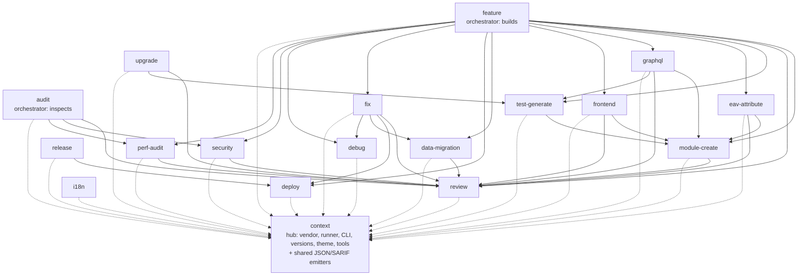
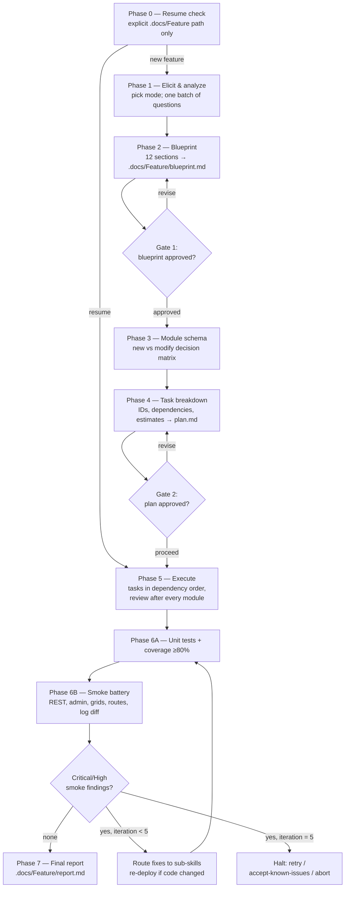
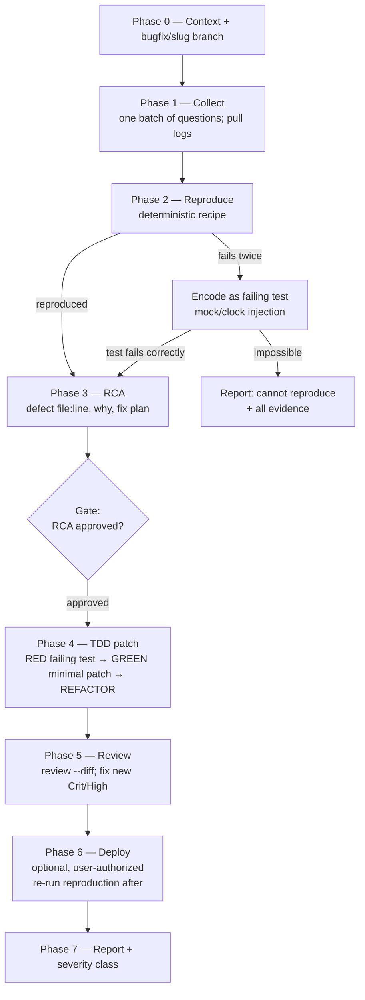
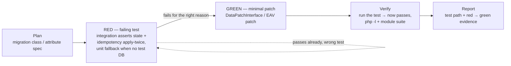
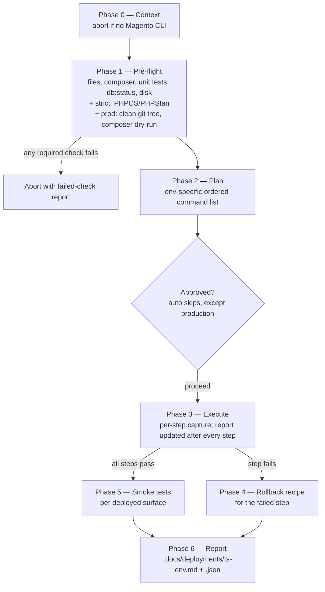
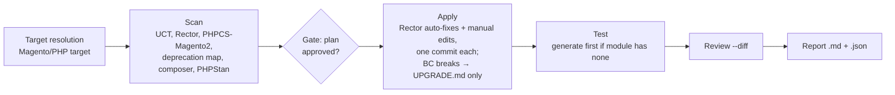
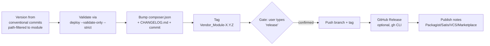
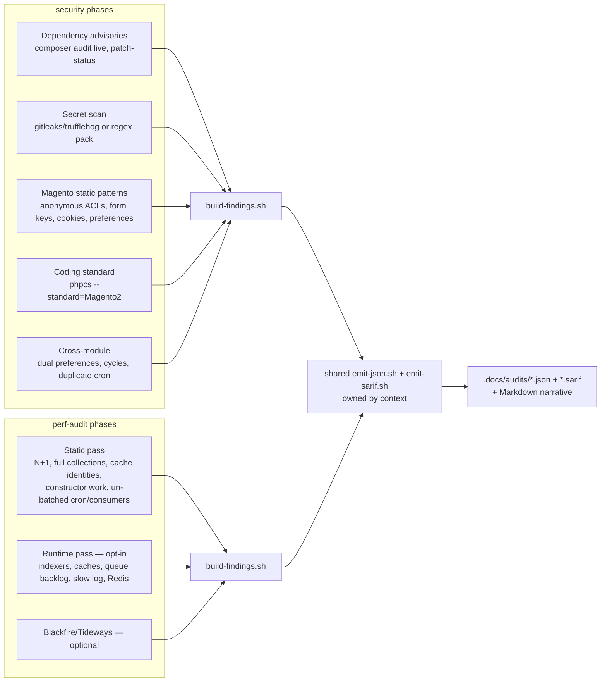
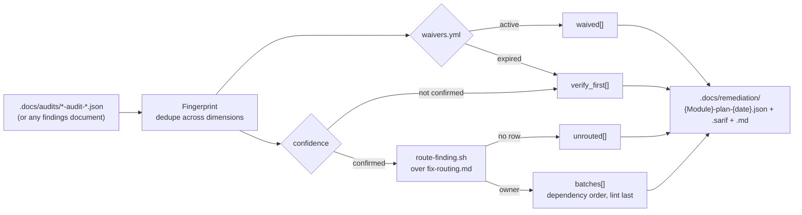
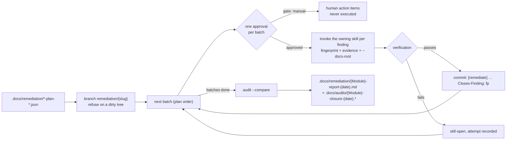

# Flows and scenarios

A full observation of how the toolkit's skills work and work together: the
architecture, each major flow phase-by-phase, the approval-gate map, the artifact map,
and end-to-end scenario walkthroughs.

## Architecture: hub and spoke

`context` is the universal leaf — every other skill resolves environment
questions through it, and it depends on nothing. It also owns the shared findings
emitters (JSON/SARIF) that every findings-emitting skill reuses.
`feature` is the top orchestrator.


```mermaid
graph TD
    CTX[context<br/>hub: vendor, runner, CLI, versions, theme, tools<br/>+ shared JSON/SARIF emitters]

    FI[feature<br/>orchestrator: builds]
    AUD[audit<br/>orchestrator: inspects]
    BF[fix]
    MC[module-create]
    MR[review]
    TG[test-generate]
    DEP[deploy]
    UPG[upgrade]
    REL[release]
    SEC[security]
    PERF[perf-audit]
    DBG[debug]
    EAV[eav-attribute]
    GQL[graphql]
    FE[frontend]
    DM[data-migration]
    I18N[i18n]

    FI --> MC & MR & TG & EAV & GQL & FE & DM & DEP & BF & DBG & SEC & PERF
    AUD --> MR & SEC & PERF
    BF --> MR & DEP & DM & DBG
    MC --> MR
    UPG --> MR & TG
    REL --> DEP
    SEC --> MR
    PERF --> MR
    EAV --> MC & MR
    GQL --> MC & MR & TG
    FE --> MC & MR
    DM --> MR
    TG --> MC

    MC -.-> CTX
    MR -.-> CTX
    FI -.-> CTX
    AUD -.-> CTX
    BF -.-> CTX
    DEP -.-> CTX
    UPG -.-> CTX
    REL -.-> CTX
    SEC -.-> CTX
    PERF -.-> CTX
    DBG -.-> CTX
    EAV -.-> CTX
    GQL -.-> CTX
    FE -.-> CTX
    DM -.-> CTX
    I18N -.-> CTX
    TG -.-> CTX
```

Dotted edges: context resolution (all skills). Solid edges: workflow delegation.
Only the skills with cross-skill edges are drawn; `audit` additionally dispatches `lint`,
`a11y-audit`, `marketplace`, and `breeze-compat` where the module's surface warrants them,
and the generator skills (`webapi`, `admin-form`, `admin-listing`, `system-config`,
`cli-command`, `extension-point`, `message-queue`, `indexer`, `docs`, the `breeze-*`
trio) all resolve through `context` and hand their output to `review`. The full graph is
in the [repository README](../README.md).

There are two orchestrators, and they are counterparts: `feature` **builds**, `audit`
**inspects**.

### Shared infrastructure

Five pieces keep the 36 skills consistent:

1. **The context document.** One JSON object (cached at
   `.claude/.cache/context.json`) holding vendor, layout, edition, versions,
   the runner prefix, the Magento CLI command, theme, and tool paths. Skills consume
   `{ctx.*}` values and never re-resolve them independently. Missing tools are `null` —
   honest gaps, never invented paths.
2. **The findings schema and severity scale.**
   `skills/context/references/findings-schema.md` and
   `skills/context/references/severity.md` define
   one finding shape and one Critical/High/Medium/Low/Info scale. `review`, `security`,
   `perf-audit`, `lint`, `marketplace`, `a11y-audit`, `breeze-compat`, `upgrade`, and
   `audit` all emit it. Scripted scanners funnel through one shared engine,
   `context/scripts/findings-lib.sh` (scanner execution with JSON validation, per-scanner
   stderr capture into `scanner_errors`, findings merge), and out through the shared
   `emit-findings.sh` → `emit-json.sh` / `emit-sarif.sh` scripts — all owned by
   `context`.
3. **The `.docs/` artifact convention.** Every skill writes its durable outputs to a
   predictable folder in *your* project (see [artifact map](#artifact-map)).
4. **Naming and placeholders.** `skills/context/references/naming.md` is the
   single naming authority; templates share a placeholder registry enforced by the
   repo's contract tests.
5. **The test-first discipline.**
   `skills/context/references/tdd-discipline.md` defines one red → green →
   refactor loop and the **behaviour/boilerplate line** (what is written test-first vs.
   exempt scaffold/config), plus the interface-first seam and a tiered fallback for when
   no test DB is available. It is consumed by `fix` (always), by
   `feature` under TDD mode, and by `data-migration` and
   `eav-attribute` (test-first by default for the data/attribute effect).

---

## Feature implementation flow

`feature` — the orchestrator. Seven phases, two approval gates, one
bounded smoke loop.


```mermaid
flowchart TD
    P0[Phase 0 — Resume check<br/>explicit .docs/Feature path only] -->|new feature| P1
    P0 -->|resume| P5
    P1[Phase 1 — Elicit & analyze<br/>pick mode; one batch of questions] --> P2
    P2[Phase 2 — Blueprint<br/>12 sections → .docs/Feature/blueprint.md] --> G1{Gate 1:<br/>blueprint approved?}
    G1 -->|revise| P2
    G1 -->|approved| P3
    P3[Phase 3 — Module schema<br/>new vs modify decision matrix] --> P4
    P4[Phase 4 — Task breakdown<br/>IDs, dependencies, estimates → plan.md] --> G2{Gate 2:<br/>plan approved?}
    G2 -->|revise| P4
    G2 -->|"proceed"| P5
    P5[Phase 5 — Execute<br/>tasks in dependency order,<br/>review after every module] --> P6A
    P6A[Phase 6A — Unit tests + coverage ≥80%] --> P6B
    P6B[Phase 6B — Smoke battery<br/>REST, admin, grids, routes, log diff] --> S9{Critical/High<br/>smoke findings?}
    S9 -->|none| P7[Phase 7 — Final report<br/>.docs/Feature/report.md]
    S9 -->|"yes, iteration < 5"| FIX[Route fixes to sub-skills<br/>re-deploy if code changed]
    FIX --> P6A
    S9 -->|"yes, iteration = 5"| HALT[Halt: retry /<br/>accept-known-issues / abort]
```

**Modes** (chosen in Phase 1): `feature` (full pipeline), `hotfix` and `extend` (skip
Phases 3–4; only the blueprint gate), `spike` (reduced Phases 6–7, findings logged at
Info).

**Task types executed in Phase 5:** `M*` create module (→ `module-create`),
`X*` modify existing, `R*` review (→ `review --diff`; Critical/High
fixed before the next task), `T*` tests (→ `test-generate`), `E*` EAV
attribute (→ `eav-attribute`), `G*` GraphQL (→ `graphql`),
`V*` validate (PHPCS + PHPMD + PHPStan L8 + PHPUnit), `D*` deploy
(→ `deploy`), `S*` smoke suites.

**Test-first (TDD mode, opt-in):** with `--tdd` (or `Feature implement: tdd = on` /
`MAGENTO2_FI_TDD=1`; default off, `spike` exempt), Phase 5 implements behaviour-bearing
`M*`/`X*` classes test-first — scaffold the signature, write the failing test from the
task's acceptance criteria, watch it fail for the right reason, then fill the minimal
body to green. The `T*` task then becomes a coverage top-up (via `test-generate`
on exempt/boilerplate classes) rather than the first author of behaviour tests. Pure
scaffold/config (registration, DI, `module.xml`, plain DTOs, `db_schema`) stays
generated-then-covered. See `context/references/tdd-discipline.md`.

**Smoke fix routing (S9):** new `exception.log` groups are triaged by
`debug`, defects go to `fix`, slow pages/N+1 to
`perf-audit`, ACL/CSRF/escaping regressions to
`security`, JS/asset regressions to `frontend`,
schema/data-patch regressions to `data-migration`. After any code fix the
modules are re-deployed and the loop re-enters at 6A (so unit tests are re-validated
too).

**Resumability:** `plan.md` holds the Mermaid diagrams plus a Current State checkbox
list; each completed task is checked off immediately. An explicit *"resume
./.docs/{FeatureName}"* jumps straight to the first unchecked task — approvals are not
re-asked. Blueprint `Status:` transitions: `Awaiting Approval` → `Approved` →
`In Progress` → `Complete`.

---

## Bug-fix flow

`fix` — surgical remediation, TDD-first, one gate.


```mermaid
flowchart TD
    P0[Phase 0 — Context + bugfix/slug branch] --> P1
    P1[Phase 1 — Collect<br/>one batch of questions; pull logs] --> P2
    P2[Phase 2 — Reproduce<br/>deterministic recipe] -->|fails twice| ALT[Encode as failing test<br/>mock/clock injection]
    ALT -->|test fails correctly| P3
    ALT -->|impossible| CNR[Report: cannot reproduce<br/>+ all evidence]
    P2 -->|reproduced| P3
    P3[Phase 3 — RCA<br/>defect file:line, why, fix plan] --> G{Gate:<br/>RCA approved?}
    G -->|approved| P4
    P4[Phase 4 — TDD patch<br/>RED failing test → GREEN minimal patch → REFACTOR] --> P5
    P5[Phase 5 — Review<br/>review --diff; fix new Crit/High] --> P6
    P6[Phase 6 — Deploy<br/>optional, user-authorized<br/>re-run reproduction after] --> P7
    P7[Phase 7 — Report + severity class]
```

Invariants: minimal diff; no scope expansion (extra bugs found → filed separately);
regression test required (waivers only for provably-untestable bugs or pure-config
changes validated by XSD, both recorded in the RCA and user-confirmed); `vendor/` never
edited; per-phase `[bug-fix]` commits on the bugfix branch; the skill never pushes.

Redirects: schema changes → `feature --mode=extend`; data repairs →
idempotent patch via `data-migration` (stays in-skill); hard-to-reproduce
investigation → `debug`.

The red → green → refactor loop `fix` applies is the shared
`context/references/tdd-discipline.md` — the same discipline the test-first
builders below use.

---

## Test-first builders (data-migration, eav-attribute)

Two builder skills are **test-first by default** (no flag needed): the test for the
data/attribute effect is written and watched to fail before the patch that satisfies it.


```mermaid
flowchart LR
    P1[Plan<br/>migration class / attribute spec] --> P2[RED — failing test<br/>integration asserts state +<br/>idempotency apply-twice,<br/>unit fallback when no test DB]
    P2 -->|fails for the right reason| P3[GREEN — minimal patch<br/>DataPatchInterface / EAV patch]
    P3 --> P4[Verify<br/>run the test → now passes,<br/>php -l + module suite] --> P5[Report<br/>test path + red → green evidence]
    P2 -.->|passes already, wrong test| P2
```

- **`data-migration`** (Phase 2 *Test First, then Generate*): the integration
  test asserts post-migration state **and idempotency** (apply twice → identical rows, no
  duplicates, no error). Idempotency is the skill's headline guarantee, so it is pinned by
  a test rather than by inspection.
- **`eav-attribute`** (Phase 3 *Test First, then Generate*): the integration test
  asserts the attribute exists after the patch with the declared **scope** (`is_global`),
  `frontend_input`, and backend/source wiring, plus idempotency; behavioural source/backend
  models get a test-first unit test.
- **Tiered fallback:** when no Magento test DB is available, both degrade honestly — a
  test-first *unit* test of the idempotency guard / behavioural model, with the integration
  gap recorded in the report — rather than skipping the discipline.

These complement, not replace, `test-generate`, which remains the backfiller for
modules whose code already exists (including ones with no tests at all).

---

## Deploy flow

`deploy` — validate, plan, execute, smoke, report; rollback by recipe.


```mermaid
flowchart TD
    P0[Phase 0 — Context<br/>abort if no Magento CLI] --> P1
    P1[Phase 1 — Pre-flight<br/>files, composer, unit tests, db:status, disk<br/>+ strict: PHPCS/PHPStan<br/>+ prod: clean git tree, composer dry-run] -->|any required check fails| ABORT[Abort with failed-check report]
    P1 --> P2[Phase 2 — Plan<br/>env-specific ordered command list]
    P2 --> G{Approved?<br/>auto skips, except production}
    G -->|proceed| P3[Phase 3 — Execute<br/>per-step capture; report updated after every step]
    P3 -->|step fails| P4[Phase 4 — Rollback recipe<br/>for the failed step]
    P3 -->|all steps pass| P5[Phase 5 — Smoke tests<br/>per deployed surface]
    P5 --> P6[Phase 6 — Report<br/>.docs/deployments/ts-env.md + .json]
    P4 --> P6
```

Environment plans: local/staging run `module:status` → `module:enable` →
`setup:upgrade` → whitelist generation → `cache:flush` → `indexer:status`. Production
wraps that in `maintenance:enable`/`disable` and adds `setup:di:compile`,
`setup:static-content:deploy -f`, selective `indexer:reindex`, and consumer starts.

The critical caveat: **`setup:upgrade` rollback is lossy without a DB backup** —
applied data patches stay applied and declarative-schema drops destroy data. The
snapshot script supports `--include-db` (mysqldump) precisely for this. Smoke failures
after a completed deploy do *not* auto-rollback; they are reported for investigation.

`--validate-only` stops after Phase 2 with an exit code — the building block
`release` and CI pipelines use.

---

## Module upgrade flow

`upgrade` — the change list is *derived from scanners*, not described
by the user.


```mermaid
flowchart LR
    P1[Target resolution<br/>Magento/PHP target] --> P2[Scan<br/>UCT, Rector, PHPCS-Magento2,<br/>deprecation map, composer, PHPStan]
    P2 --> P3{Gate: plan<br/>approved?}
    P3 --> P4[Apply<br/>Rector auto-fixes + manual edits,<br/>one commit each;<br/>BC breaks → UPGRADE.md only]
    P4 --> P5[Test<br/>generate first if module has none]
    P5 --> P6[Review --diff] --> P7[Report .md + .json]
```

Findings are classified `auto-fixable` / `manual-fixable` / `bc-break`. BC breaks are
**documented, not silently fixed** (callers must be warned via the module's
`UPGRADE.md`) unless you opt in with `--include-bc-breaks`. `--scan-only` gives you the
report with zero edits.

---

## Release flow

`release` — semver from commits, gated push.


```mermaid
flowchart LR
    P1[Version from<br/>conventional commits<br/>path-filtered to module] --> P2[Validate via<br/>deploy --validate-only --strict]
    P2 --> P3[Bump composer.json<br/>+ CHANGELOG.md + commit]
    P3 --> P4[Tag<br/>Vendor_Module-X.Y.Z]
    P4 --> G{Gate: user types<br/>'release'}
    G -->|confirmed| P5[Push branch + tag]
    P5 --> P6[GitHub Release<br/>optional, gh CLI]
    P6 --> P7[Publish notes<br/>Packagist/Satis/VCS/Marketplace]
```

Guards: downgrade/equal `--version` overrides are refused; validation must pass before
any file changes; pushing requires the literal confirmation word; branch protection is
respected.

---

## Audit pipeline (security + performance)

Both audits share one output pipeline: scanners → `build-findings.sh` → shared
`emit-json.sh` + `emit-sarif.sh` → Markdown narrative written by the skill. Each skill's
`build-findings.sh` is a thin wrapper over the single engine
`context/scripts/findings-lib.sh`, so scanner execution, JSON validation, `scanner_errors`
capture, and the merge behave identically across every findings skill.


```mermaid
flowchart LR
    subgraph security [security phases]
        S2[Dependency advisories<br/>composer audit live, patch-status]
        S3[Secret scan<br/>gitleaks/trufflehog or regex pack]
        S4[Magento static patterns<br/>anonymous ACLs, form keys, cookies, preferences]
        S5[Coding standard<br/>phpcs --standard=Magento2]
        S6[Cross-module<br/>dual preferences, cycles, duplicate cron]
    end
    subgraph performance [perf-audit phases]
        T2[Static pass<br/>N+1, full collections, cache identities,<br/>constructor work, un-batched cron/consumers]
        T3[Runtime pass — opt-in<br/>indexers, caches, queue backlog, slow log, Redis]
        T4[Blackfire/Tideways — optional]
    end
    S2 & S3 & S4 & S5 & S6 --> BF1[build-findings.sh]
    T2 & T3 & T4 --> BF2[build-findings.sh]
    BF1 & BF2 --> EMIT[shared emit-json.sh + emit-sarif.sh<br/>owned by context]
    EMIT --> OUT[.docs/audits/*.json + *.sarif<br/>+ Markdown narrative]
```

Severity is calibrated against the shared scale with domain anchors — e.g. a committed
secret or RCE-class CVE is Critical; an N+1 in checkout totals is High; an indexer in
update-on-save mode is Info. PCI-scope-elevating or PII-exposing findings are bumped to
Critical/High by default. Skipped scanners and `scanner_errors` are reported, never
silently dropped.

---

## Remediation cycle (triage → remediate → closure)

The audit pipeline answers *what is wrong*. `triage` answers **who fixes it, in what
order** — read-only, and as a document you approve rather than a conversation you re-hold
every run. `remediate` then executes that document, and `audit --compare` says what
actually closed.

```
audit / review / security / perf-audit  ──►  triage  ──►  remediate  ──►  audit --compare
        (what is wrong)                     (the plan)    (the work)      (what closed)
```


```mermaid
flowchart LR
    IN[".docs/audits/*-audit-*.json<br/>(or any findings document)"] --> FP[Fingerprint<br/>dedupe across dimensions]
    FP --> W{waivers.yml}
    W -- active --> WB["waived[]"]
    W -- expired --> VF["verify_first[]"]
    FP --> C{confidence}
    C -- "not confirmed" --> VF
    C -- confirmed --> R[route-finding.sh<br/>over fix-routing.md]
    R -- "no row" --> UR["unrouted[]"]
    R -- owner --> B["batches[]<br/>dependency order, lint last"]
    WB & VF & UR & B --> OUT[".docs/remediation/<br/>{Module}-plan-{date}.json + .sarif + .md"]
```

Four rules hold the cycle together:

1. **Identity survives the fix.** A finding's `fingerprint` is a hash of
   producer/category/subcategory/title/file/normalized-snippet — *not* its line number or
   run date, both of which move the moment the file is patched. That is what lets a waiver
   or a closure verdict taken in one run still apply in the next.
2. **Routing is a contract.** `skills/context/references/fix-routing.md` maps every
   `(producer, category)` pair the findings schema declares to an owning skill and a gate;
   `tests/test-fix-routing-matrix.sh` fails the build if the schema grows a category the
   matrix has no owner for. No row means `unrouted[]`, never a silent default to `fix`.
3. **Nothing is dropped.** Waived, held-for-verification, unroutable and severity-filtered
   findings each land in a named bucket with a reason. A waived finding is reported, never
   counted as closed; an expired waiver *resurfaces* the finding.
4. **Batch order is a dependency order.** `upgrade` first (it rewrites call sites the later
   batches would otherwise patch twice), `lint` last (it formats what the run produced —
   running it first guarantees re-churn). A Critical `lint` finding still runs last.

### Executing the plan (`remediate`)


```mermaid
flowchart LR
    P[".docs/remediation/*-plan-*.json"] --> BR["branch remediation/{slug}<br/>refuse on a dirty tree"]
    BR --> B["next batch (plan order)"]
    B --> G{"one approval<br/>per batch"}
    G -- "gate: manual" --> HA["human action items<br/>never executed"]
    G -- approved --> EX["invoke the owning skill per finding<br/>fingerprint + evidence + --docs-root"]
    EX --> V{verification}
    V -- passes --> C["commit: [remediate] … Closes-Finding: fp"]
    V -- fails --> SO["still-open, attempt recorded"]
    C & SO --> B
    B -- "batches done" --> CL["audit --compare"]
    CL --> R[".docs/remediation/{Module}-report-{date}.md<br/>+ .docs/audits/{Module}-closure-{date}.*"]
```

Three rules carry over into execution:

1. **One approval per batch, never per finding.** The owning skills delegate their own gate
   upward — `fix --from-finding=` drafts its RCA into the batch presentation instead of
   stopping for its own approval — so a 40-finding report is a handful of decisions, not 40.
2. **A `gate: manual` finding is never executed.** Deleting the line that printed a secret
   does not un-leak it, so it becomes a human action item and the closure diff tags it
   `pending-manual` rather than "remediation failed".
3. **No silent passes.** A failed `verification` is `still-open` with the attempt recorded; a
   batch whose owning skill is unavailable is `skipped` with its reason. Neither is ever
   counted clean — an absent result is not a result. The closure diff, not the executor's own
   bookkeeping, is what proves closure, and its `regressed` bucket is what the run
   *introduced*.

`remediate` never edits `vendor/`, never pushes or merges, and commits one finding at a time
with a `Closes-Finding: <fingerprint>` trailer — so a reviewer can revert exactly one
remediation without unpicking the rest.

---

## Approval-gate map

Where each skill stops and waits for you:

| Skill | Gate(s) | What unlocks it |
|-------|---------|-----------------|
| `feature` | Blueprint (Phase 2); task plan (Phase 4); smoke-loop halt at 5 iterations | "proceed" / "approved"; halt: `retry` / `accept-known-issues <IDs>` / `abort` |
| `fix` | RCA before any production-code change | "proceed" / "approved" |
| `module-create` | Module profile confirm (multi-surface); full plan confirm at ≥3 surfaces or ≥20 files; parallel creation always opt-in | confirmation |
| `test-generate` | Test plan before generation | "proceed" |
| `eav-attribute` | File plan before generation | "proceed" |
| `graphql` | Schema + resolver plan | approval |
| `upgrade` | Scan report before applying (skipped by `--auto-fix`) | "proceed" |
| `deploy` | Plan before execution (skipped by `--auto`, never on production); production interactive confirm; prod snapshot prompt | "proceed"; `--i-know-what-im-doing` for auto+prod |
| `release` | Push/tag | literally typing `release` |
| `remediate` | One approval per **batch** of findings (never per finding); `gate: manual` items are never executable | "proceed" / "approved"; `--yes-auto` pre-approves `auto` batches only; `--dry-run` executes nothing |
| `audit` | none for the analysis itself; fanning the dimensions out to subagents is opt-in authorization, exactly as `review`'s parallel mode is | `--agents`, or `execution_mode` in `.claude/m2.json` |
| `review`, `triage`, `debug`, the specialist audits, `i18n` | none — read-only or additive-report skills | — |

Approval gates **always run in the main conversation**. Neither execution mode delegates
a gate to a subagent — see
[Configuration → Execution modes](configuration.md#execution-modes-agents-vs-inline).

---

## Artifact map

Everything durable lands under `.docs/` in your project:

```
.docs/
├── {FeatureName}/                      # feature: blueprint.md, plan.md,
│   ├── blueprint.md                    #   tasks.md or tasks/, report.md,
│   ├── plan.md                         #   guides/*.html, user-docs/*.html, spec.md
│   └── ...                             #   (sub-skill output nests under this root too)
├── spikes/{slug}/                      # feature --mode=spike
├── bug-fixes/{slug}/                   # fix: collect.md, reproduction.md, rca.md, report.md
├── deployments/{ts}-{env}.md|.json     # deploy reports (+ .snapshot.tar.gz, -preflight.json)
├── reviews/{Vendor}_{Module}-review-{date}.*      # review .md/.json/.sarif
├── audits/{Vendor}_{Module}-audit-{date}.*        # audit: consolidated + merged SARIF
├── audits/security-{scope}-{date}.*               # security .md/.json/.sarif
├── audits/perf-{scope}-{date}.*                   # perf-audit .md/.json/.sarif
├── quality/{Vendor}_{Module}-quality-{date}.*     # lint .md/.json/.sarif
├── accessibility/{Vendor}_{Module}-a11y-{date}.*  # a11y-audit .md/.json/.sarif
├── marketplace/{Vendor}_{Module}-readiness-{date}.*   # marketplace readiness
├── breeze-compat/{Vendor}_{Module}-breeze-compat-{date}.*
├── remediation/{Vendor}_{Module}-plan-{date}.*      # triage remediation plan
├── remediation/{Vendor}_{Module}-report-{date}.md   # remediate run report
├── audits/{Vendor}_{Module}-closure-{date}.*        # audit --compare closure diff
├── findings/waivers.yml                            # INPUT: per-fingerprint suppressions
├── upgrades/{Vendor}_{Module}-upgrade-{date}.md|.json
├── tests/{Vendor}_{Module}-coverage-{date}.md     # test-generate coverage report
├── docs-generated/{Vendor}_{Module}-{date}.md     # docs run report
├── eav-attributes/{Module}-{code}-{date}.md
├── migrations/{name}-{date}.md
├── i18n/{Module}-{date}.md
├── debug/snapshot-{date}.md            # only with --save
├── releases/{Module}-{Version}.md      # release notes
└── …                                   # one run-report dir per generator skill:
                                        #   adminhtml-forms/, adminhtml-listings/,
                                        #   cli-commands/, extension-points/, indexers/,
                                        #   message-queues/, system-config/
```

Every path above is a *category* directory appended to the run's **output root** —
`.docs` by default, or whatever `--docs-root={path}` sets. The authoritative registry of
category names and filename tokens is
`skills/context/references/artifact-layout.md`.

Code artifacts go where Magento expects them: modules under
`{magento_root}/app/code/{Vendor}/`, themes under `app/design/frontend/{Vendor}/`,
tests under each module's `Test/` tree, translations under each module's `i18n/`.

---

## End-to-end scenarios

### Scenario 1 — New feature: "store pickup notes"

> *"Customers should be able to leave a pickup note at checkout; admins see it on the
> order grid."*

1. `feature` picks `feature` mode, asks one batch of questions
   (which checkout? REST or GraphQL exposure? Hyva or Luma?), writes the blueprint.
   **You approve it.**
2. Module schema: one new module `Acme_PickupNotes` (surfaces: persistence,
   service_contracts, frontend_ui, admin_ui) + a modification to the order grid.
3. Task plan: `M1` create module, `R1` review, `E1` (none), `X1` grid column, `R2`,
   `T1` tests, `V1` validate, `D1` deploy local, `S1`/`S8` + checkout/admin smoke
   suites. **You approve.**
4. Execution: module created (every file review-clean on creation), reviewed, grid
   change applied and lint-checked, tests generated and passing, PHPCS/PHPStan/PHPUnit
   green, deployed via `deploy`. *(With `--tdd` on, the service/observer
   behaviour is written test-first instead — failing test from the acceptance criteria,
   then the minimal body — and `T1` only tops up coverage on the boilerplate.)*
5. Smoke: REST scenario places an order with a note; admin grid renders; checkout flow
   completes; `exception.log` diff is clean. Suppose the grid 500s — the finding is
   triaged by `debug`, fixed by `fix`, re-deployed, and the loop
   re-runs from unit tests. Bounded at 5 iterations.
6. Final report in `.docs/PickupNotes/report.md`, plus an admin user guide in HTML.

### Scenario 2 — Production incident: checkout 500

> *"Since yesterday's deploy, some checkouts fail with a 500."*

1. Triage read-only: `/magento2-tools:debug logs --since=24h
   --pattern=checkout` groups the exceptions; `trace --method='…\QuoteManagement::placeOrder'`
   shows which plugin intercepts it.
2. `fix "checkout 500 — TypeError in Acme_GiftWrap plugin"` collects,
   reproduces (REST recipe), writes the RCA pointing at yesterday's commit. **You
   approve.**
3. Failing regression test → minimal patch → suite green → `--diff` review →
   `deploy --env=production --snapshot` (interactive confirm + DB-inclusive
   snapshot) → reproduction recipe re-run against production passes.
4. `.docs/bug-fixes/checkout-500-giftwrap/` holds the full audit trail.

### Scenario 3 — Pre-launch hardening

1. `/magento2-tools:security --scope=site` — CVEs, secrets, anonymous
   endpoints, cross-module collisions. SARIF goes to Code Scanning.
2. `/magento2-tools:perf-audit --runtime --scope=site` — static N+1 and
   caching findings plus live indexer/queue/cache/slow-log checks.
3. `/magento2-tools:triage` turns both documents into one ordered plan: every finding
   fingerprinted, waiver-checked, routed (dependency CVEs → `upgrade`, code defects →
   `fix`, a leaked key → a human action), batched in dependency order. **You approve it.**
4. `/magento2-tools:remediate --dry-run` to inspect the batches, then without it to execute:
   one approval per batch, one commit per finding, each ending in a `--diff` review.
5. `audit --compare` against the original document closes the loop — what closed, what is
   still open, and anything the remediation itself *introduced*. Rotate the leaked key by
   hand; until you do it stays `pending-manual`, not closed.

### Scenario 4 — Platform upgrade to Magento 2.4.7

1. Per module: `/magento2-tools:upgrade --scan-only --to-magento=2.4.7
   Acme_Checkout` — classified findings, zero edits.
2. After reading the reports: re-run without `--scan-only`. **Approve the plan.**
   Rector auto-fixes commit per rule set; manual fixes commit per change; BC breaks are
   written to each module's `UPGRADE.md` for consumers.
3. Tests run (generated first for uncovered modules), `--diff` review passes,
   per-module reports land in `.docs/upgrades/`.
4. Deploy to staging via `deploy --env=staging --strict`.

### Scenario 5 — Release day

1. `/magento2-tools:release Acme_OrderExport` — commits since
   `Acme_OrderExport-1.3.0` contain two `fix:` and one `feat:` → proposes `1.4.0`.
2. Pre-flight validation passes (`deploy --validate-only --strict`).
3. CHANGELOG and composer.json bumped; tag `Acme_OrderExport-1.4.0` created.
4. You type `release` → branch + tag pushed → GitHub Release created from the generated
   notes in `.docs/releases/OrderExport-1.4.0.md`.

### Scenario 6 — New developer, existing project

Day one for a developer joining a project that already uses the toolkit:

1. Open the repo in Claude Code → folder trust prompt auto-installs the plugin (the
   team committed `.claude/settings.json`).
2. *"Resolve the Magento context"* — see exactly how this project runs (Docker? `src/`
   layout? Hyva?) without reading a wiki.
3. `/magento2-tools:debug snapshot` — current health of the local instance.
4. Read `.docs/` — recent feature blueprints, bug RCAs, deploy history: the project's
   engineering memory.
5. First ticket: *"fix: …"* → `fix` walks them through the house style —
   reproduction, RCA gate, TDD, review — by construction.
