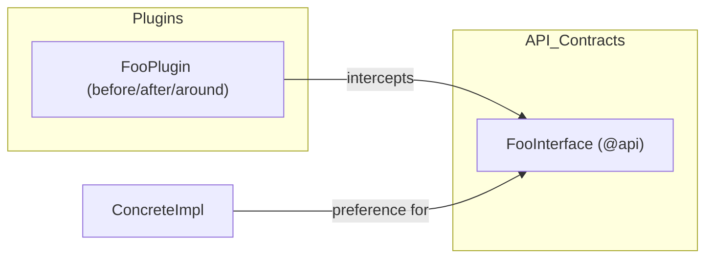
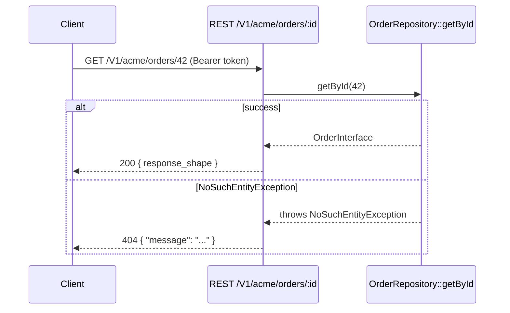
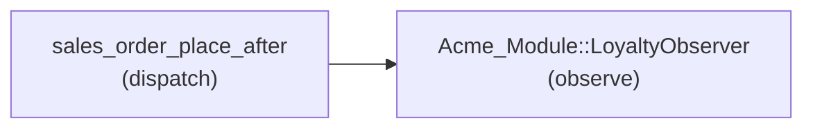
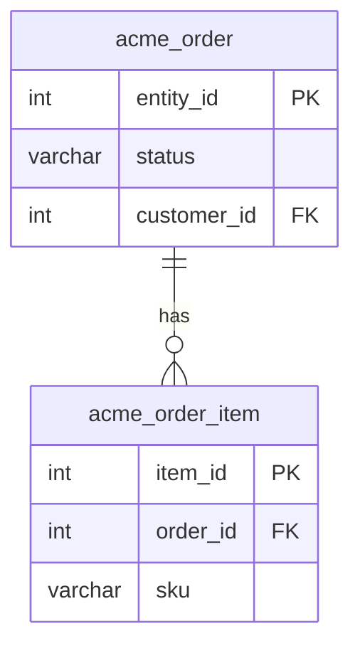

# Documentation Structure Reference

Canonical section order for the two primary output documents. Sections with no extracted
content are omitted entirely — never include empty tables or placeholder rows.

---

## README Structure

Rendered from `templates/readme.md`. Target file: `{module}/README.md`.

### Required sections (always present)

1. **Module name heading** — `# {Vendor}_{Module}`
2. **Description** — one paragraph from `{MODULE_DESCRIPTION}`.
3. **Requirements** — Magento version, PHP version (from composer.json `require`).
4. **Installation** — `bin/magento module:enable {Vendor}_{Module}` +
   `bin/magento setup:upgrade` + `bin/magento cache:flush`, plus the conditional
   declarative-schema whitelist step described immediately below.

   **Conditional whitelist step:** the Installation section additionally includes, after
   `setup:upgrade`, `bin/magento setup:db-declaration:generate-whitelist
   --module-name={Vendor}_{Module}` when the module declares a `db_schema.xml`
   (declarative schema) surface. Omitted entirely — no paragraph, no command — when the
   module has no `db_schema.xml`, following the same "omit when the surface is absent"
   rule as the Features/Configuration/Public API sections below. This step was previously
   (and incorrectly) documented as something `magento2-module-create` writes into
   `README.md`; docs-generate now owns it since it owns the whole README.

### Documentation link (always present)

5. **Documentation** — a single "Full technical reference" link to
   `docs/technical-reference.md` covering all surfaces (API, events, plugins, REST,
   GraphQL, DB schema, extension attributes, config paths). The README stays concise;
   per-surface detail lives in the technical reference.

### Closing sections (always present)

6. **Dependencies** — `{DEPENDENCIES_LIST}` from `composer.json require`.

### Richer sections (conditional — each omitted, heading and all, when its surface is absent)

Rendered between **Dependencies** and **Documentation** in `templates/readme.md`. These were
consolidated from module-create's README template so that docs-generate is the single owner
of every module README; each follows the skill's existing "OMIT empty surfaces" rule — never
render an empty table or a placeholder row.

| Section | Heading | Token | Derived from | Omit when |
|---------|---------|-------|---------------|-----------|
| Features | `## Features` | `{FEATURES_LIST}` | `module.xml` + the module's declared surfaces (a bulleted summary of what the module does, derived from its API/config/CLI/queue/GraphQL/REST surfaces) | The module has no summarizable surface (rare — a stub module) |
| Configuration | `## Configuration` | `{CONFIG_TABLE}` | `etc/adminhtml/system.xml` (Field / Description / Default columns) | `etc/adminhtml/system.xml` has no fields (no admin configuration) |
| Public API | `## Public API` | `{PUBLIC_API_TABLE}` | `@api`-annotated interfaces under `Api/` (Interface / Description columns) | The module declares no `@api` interfaces |
| Known Limitations | `## Known Limitations` | `{KNOWN_LIMITATIONS}` | Extractor- or user-supplied notes on intentional constraints or out-of-scope behavior | No limitations are supplied — never invented by the generator |

---

## Technical Reference Structure

Rendered from `templates/technical-reference.md`.
Target file: `{module}/docs/technical-reference.md`.

### Preamble (always present)

- Heading `# {Vendor}_{Module} — Technical Reference`
- One-line purpose statement.
- Link back to `../README.md`.

### Surface sections (each omitted when the surface has zero entries)

Each section heading is an anchor used by the README's conditional sections above.

| Section | Heading | Anchor | Token |
|---------|---------|--------|-------|
| Public API | `## Public API Surface` | `#api-surface` | `{API_SURFACE_TABLE}` |
| Events fired | `## Events Fired` | `#events-fired` | `{EVENTS_TABLE}` |
| Events observed | `## Events Observed` | `#events-observed` | included in `{EVENTS_TABLE}` |
| Plugins | `## Plugins` | `#plugins` | `{PLUGINS_TABLE}` |
| Preferences | `## Preferences` | `#preferences` | included in `{PLUGINS_TABLE}` |
| Config paths | `## Admin Config Paths` | `#config-paths` | `{CONFIG_PATHS_TABLE}` |
| CLI commands | `## CLI Commands` | `#cli-commands` | `{CLI_COMMANDS_TABLE}` |
| Cron jobs | `## Cron Jobs` | `#cron-jobs` | `{CRON_TABLE}` |
| REST routes | `## REST Routes` | `#rest-routes` | `{REST_ROUTES_TABLE}` |
| GraphQL | `## GraphQL` | `#graphql` | `{GRAPHQL_TABLE}` |
| DB schema | `## Database Schema` | `#database-schema` | `{DB_SCHEMA_TABLE}` |
| Extension attributes | `## Extension Attributes` | `#extension-attributes` | `{EXTENSION_ATTRIBUTES_TABLE}` |

### Closing sections (always present)

- `## Module Dependencies` — requires/suggests from `composer.json`.
- `## Source File` — note that this document is auto-generated; cite the skill version.

---

## Table Column Conventions

### API Surface table columns

| Column | Content |
|--------|---------|
| Type | `interface` or `class` |
| Name | Short class name (linked to source file if hosted on a known platform) |
| Source | Relative path from module root with line number |

### Events table columns (fired and observed combined)

| Column | Content |
|--------|---------|
| Direction | `fired` or `observed` |
| Event Name | snake_case event identifier |
| Class / Observer | PHP class responsible |
| Source | Relative file path + line |

### Plugins table columns (plugins and preferences combined)

| Column | Content |
|--------|---------|
| Kind | `plugin` or `preference` |
| Name | Plugin name or preference `for` interface |
| Class | Implementation class |
| Target | Intercepted class (plugins) or replaced interface (preferences) |
| Source | Relative di.xml path |

### Config paths table columns

| Column | Content |
|--------|---------|
| Config Path | `section/group/field` |
| Label | Human-readable label |
| Type | Field type |
| Source | `etc/adminhtml/system.xml` |

### CLI commands table columns

| Column | Content |
|--------|---------|
| Command | `bin/magento <command_name>` |
| Class | PHP class |
| Description | From `setDescription()` if found |
| Source | Relative PHP file path |

### Cron jobs table columns

| Column | Content |
|--------|---------|
| Job Name | Cron job identifier |
| Class::Method | `ClassName::execute` |
| Schedule | Cron expression or config path |
| Group | Cron group |
| Source | `etc/crontab.xml` |

### REST routes table columns

| Column | Content |
|--------|---------|
| Method | HTTP verb |
| URL | Route URL template |
| Service | `ClassName::method` |
| Auth | Auth scope(s) |
| Source | `etc/webapi.xml` |

### GraphQL table columns

| Column | Content |
|--------|---------|
| Kind | `type`, `input`, `interface`, `extend type` |
| Name | GraphQL type name |
| Fields | Comma-separated field names |
| Source | `etc/schema.graphqls` |

### DB schema table columns

| Column | Content |
|--------|---------|
| Table | Table name |
| Columns | Comma-separated key column names + types |
| Indexes | Index names |
| Constraints | Primary/foreign/unique |
| Source | `etc/db_schema.xml` |

---

## Developer Guide Structure

Rendered from `templates/developer-guide.md`.
Target file: `{module}/docs/developer-guide.md`.

### Sections (each omitted when the relevant surface has zero entries)

| Section | Heading | Token | Omit when |
|---------|---------|-------|-----------|
| Overview | `## Overview` | `{DEV_GUIDE_OVERVIEW}` | Never omitted |
| API Usage | `## API Usage` | `{DEV_GUIDE_API_USAGE}` | `api_methods` is empty |
| Extension Points | `## Extension Points` | `{DEV_GUIDE_EXTENSION_POINTS}` | `plugins` + `preferences` + `events_observed` all empty |
| Data Model | `## Data Model` | `{DEV_GUIDE_DATA_MODEL}` | `db_schema` + `extension_attributes` both empty |
| Event Flow | `## Event Flow` | `{DEV_GUIDE_EVENT_FLOW}` | `events_fired` + `events_observed` both empty |

---

## User Guide Structure

Rendered from `templates/user-guide.md`.
Target file: `{module}/docs/user-guide.md`.

Generated only when `user_surface` is non-empty (i.e. the module presents at least one
admin config field, admin UI component, storefront route, or email template).

### Sections (each omitted when the relevant surface has zero entries)

| Section | Heading | Token | Omit when |
|---------|---------|-------|-----------|
| Introduction | `## Introduction` | `{USER_GUIDE_INTRO}` | Never omitted |
| Configuration | `## Configuration` | `{USER_GUIDE_CONFIG}` | `user_surface.admin_config` is empty |
| Admin UI | `## Admin Interface` | `{USER_GUIDE_ADMIN_UI}` | `user_surface.admin_ui` is empty |
| Storefront | `## Storefront Features` | `{USER_GUIDE_STOREFRONT}` | `user_surface.storefront` is empty |
| Emails | `## Email Templates` | `{USER_GUIDE_EMAILS}` | `user_surface.emails` is empty |
| Screenshots | `## Screenshots` | `{USER_GUIDE_SCREENSHOTS}` | See screenshot capture-guidance appendix below |

---

## REST API Reference Structure

Rendered from `templates/api-reference.md`.
Target file: `{module}/docs/api-reference.md`.

Generated only when `rest_routes` is non-empty.

### Sections (each omitted when the relevant surface has zero entries)

| Section | Heading | Token | Omit when |
|---------|---------|-------|-----------|
| Introduction | `## Introduction` | `{API_REF_INTRO}` | Never omitted |
| Endpoints | `## Endpoints` | `{API_REF_ENDPOINTS}` | `rest_routes` is empty |

Each route under `{API_REF_ENDPOINTS}` renders as a subsection `### {METHOD} {url}` containing:
- Auth scope note.
- Request-body example (from `request_shape`) — captioned **"Example — illustrative, generated from the schema."**
- Response example (from `response_shape`) — same caption.
- Error responses table derived from `throws` + auth scope (see REST error model below).

---

## GraphQL API Reference Structure

Rendered from `templates/graphql-reference.md`.
Target file: `{module}/docs/graphql-reference.md`.

Generated only when `graphql_operations` is non-empty.

### Sections (each omitted when the relevant surface has zero entries)

| Section | Heading | Token | Omit when |
|---------|---------|-------|-----------|
| Introduction | `## Introduction` | `{GRAPHQL_REF_INTRO}` | Never omitted |
| Operations | `## Operations` | `{GRAPHQL_REF_OPERATIONS}` | `graphql_operations` is empty |

Each operation under `{GRAPHQL_REF_OPERATIONS}` renders as a subsection
`### {operation_kind}: {name}` containing:
- Arguments table (`name`, `type`).
- Return type with field list from `graphql[*].fields` for the `output_type`.
- Example request/response blocks — captioned **"Example — illustrative, generated from the schema."**
- Error responses section using the GraphQL error model below.

---

## Derivation Rules

### Example-Derivation Table

When building `request_shape`, `response_shape`, or any illustrative example block, map
PHP or GraphQL types to placeholder values as follows:

| Type | Placeholder value |
|------|------------------|
| `string` | `"string"` |
| `int` | `0` |
| `float` | `0.0` |
| `bool` | `true` |
| `array` or `iterable` | `[]` |
| `void` or `mixed` | `null` |
| DTO (`*\Api\Data\*Interface`) | nested object keyed by snake_case getter field names |
| `Type[]` (typed array) | one-element array `[<placeholder for Type>]` |
| Unresolvable type | `"string"` |

**Every rendered example block must carry the caption:**
> Example — illustrative, generated from the schema.

---

### REST Error Model

All REST API errors use the Magento standard envelope:

```json
{
  "message": "The entity with id \"42\" does not exist.",
  "parameters": { "fieldName": "id", "fieldValue": "42" },
  "trace": "..."
}
```

The `parameters` and `trace` fields may be absent in production responses (depending on
developer mode). The `trace` field is only present when `MAGE_MODE=developer`.

**HTTP status mapping** (derived per route from `throws` + auth scope):

| Exception / Condition | HTTP Status |
|-----------------------|-------------|
| `Magento\Framework\Exception\NoSuchEntityException` | 404 |
| `Magento\Framework\Exception\LocalizedException` | 400 |
| `Magento\Framework\Exception\InputException` | 400 |
| `Magento\Framework\Exception\AuthorizationException` | 403 |
| Missing or invalid bearer token | 401 |

For each route, generate an **Errors** table listing only the statuses that apply:
1. Include 401 if the route's `auth` scope is not `anonymous`.
2. Include 403 if the route has an ACL resource scope.
3. Include a row for each FQCN in the route's `throws` list mapped via the table above.

---

### GraphQL Error Model

GraphQL errors use the standard Magento extension envelope on the `errors` array:

```json
{
  "errors": [
    {
      "message": "The entity with id \"42\" does not exist.",
      "extensions": {
        "category": "graphql-no-such-entity"
      }
    }
  ]
}
```

**Category values:**

| Category | Meaning |
|----------|---------|
| `graphql-authorization` | Missing or insufficient auth token |
| `graphql-input` | Invalid argument value or type |
| `graphql-no-such-entity` | Requested entity not found |

---

### Screenshot Capture-Guidance Appendix

The `{USER_GUIDE_SCREENSHOTS}` section in the User Guide is a **Markdown checklist** — never an
`` image embed. Each checklist item gives:
1. A human-navigable path to the UI element.
2. A suggested filename for the screenshot file under `docs/screenshots/`.

**Navigation path derivation:**

| Source | Navigation path format |
|--------|----------------------|
| `user_surface.admin_config` entry | `Admin → Stores → Configuration → {tab} → {section} → {group}` |
| `user_surface.admin_ui.menu` entry | The `title` breadcrumb chain from the menu `parent` hierarchy |
| `user_surface.storefront.routes` entry | `/{frontName}/...` (the storefront URL prefix) |

**Checklist item format:**

```
- [ ] **{Label}** — navigate to `{navigation_path}`; save as `docs/screenshots/{name}.png`
```

Where `{name}` is a lowercase, hyphenated slug derived from the navigation path
(e.g. `admin-stores-config-acme-general.png`).

The `{USER_GUIDE_SCREENSHOTS}` section is omitted when `user_surface` is entirely empty.

---

### Mermaid Diagram Recipes

All Mermaid node identifiers must contain only `[A-Za-z0-9_]`. Replace namespace
separators (`\`), hyphens, and spaces with `_`. Truncate long names to keep diagrams
readable.

#### (a) Architecture / Extension-Point Graph

Source surfaces: `api`, `plugins`, `preferences`, `events_observed`.



One node per `@api` entry; one node per plugin/preference; directed edges show
interception or substitution relationships.

#### (b) Sequence Diagram — REST Route / GraphQL Operation

Source surfaces: `rest_routes` (with `request_shape`/`response_shape`/`throws`) or
`graphql_operations`.



One diagram per route or operation. Error branches are drawn for each FQCN in `throws`.

#### (c) Event-Flow Flowchart

Source surfaces: `events_fired`, `events_observed`.



One node per distinct event name; directed edges from the dispatching class to the
observing class, labelled with the event name.

#### (d) ER Diagram — Database Schema

Source surface: `db_schema`.



One entity per table. Foreign key constraints generate relationship edges. Column types
are taken from `db_schema[*].columns`. Sanitize table names: replace any non-`[A-Za-z0-9_]`
character with `_`.

---

## CHANGELOG Scaffold Structure

Rendered from `templates/changelog-scaffold.md`.
Target file: `{module}/CHANGELOG.md`.

```
# Changelog — {Vendor}_{Module}

All notable changes to this module will be documented in this file.
Format: Keep a Changelog (https://keepachangelog.com/en/1.0.0/).

## [Unreleased]

### Added
- (list additions here)

### Changed
- (list changes here)

### Fixed
- (list fixes here)

## [x.y.z] — {date}

_Initial documented release._
```

The `{date}` placeholder is substituted with the actual date at generation time. No
history is invented — the scaffold provides structure only.
