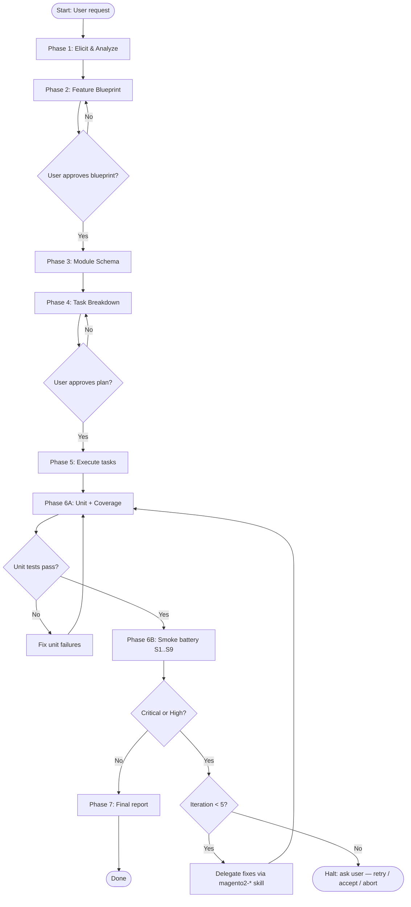

# {Feature Name} — Execution Plan

Date: {YYYY-MM-DD}
Status: Awaiting Approval
Blueprint: `.docs/{FeatureName}/blueprint.md`
Skill versions:

- magento2-feature-implement@2.9.0
- magento2-context@1.6.1

---

## Implementation Flow



---

## Module Schema

<!-- Paste the Mermaid module dependency diagram from Phase 3 here. -->

```mermaid
graph TD
    A[{Vendor}_{ModuleA}<br/>surfaces: core, persistence, service_contracts] --> B[{Vendor}_{ModuleB}<br/>surfaces: core, rest_api]
    A --> C[{Vendor}_{ModuleC}<br/>surfaces: core, admin_ui]
```

---

## Task Dependency Graph

```mermaid
graph LR
    M1[M1: Create {Vendor}_{ModuleA}] --> R1[R1: Review {Vendor}_{ModuleA}]
    R1 --> M2[M2: Create {Vendor}_{ModuleB}]
    M2 --> R2[R2: Review {Vendor}_{ModuleB}]
    R1 --> T1[T1: Tests {ModuleA}]
    R2 --> T2[T2: Tests {ModuleB}]
    T1 --> V1[V1: Validate all]
    T2 --> V1
    V1 --> D1[D1: Deploy]
    D1 --> S1[S1: Baseline & probe]
    S1 --> S2[S2: REST scenarios]
    S2 --> S3[S3: Admin login]
    S3 --> S4[S4: Stores Config]
    S4 --> S5[S5: Admin grids]
    S5 --> S6[S6: New routes]
    S6 --> S7[S7: Customer flows]
    S7 --> S8[S8: exception.log diff]
    S8 --> S9{S9: Critical/High?}
    S9 -- No --> P1[P1: Final report]
    S9 -- Yes / iter<5 --> FIX[Fix via magento2-* skill]
    FIX --> D1
    S9 -- Yes / iter==5 --> HALT([Halt: ask user])
```

<!-- Expand or replace with the actual task graph for this feature. -->

---

## Current State

<!-- This is the resumable index of tasks — IDs and titles only. The detailed task records
(Type, Target, Depends on, Included changes, Risks, Acceptance criteria) live ONLY in
`tasks.md` (≤ 5 tasks) or `tasks/` (> 5 tasks), written alongside this plan for review before
approval — never duplicated here. See `templates/task-record.md`.
Mark each task [x] immediately after it completes, before starting the next task, per
SKILL.md Phase 5 "Per-task completion protocol". This section drives resume — an unchecked
completed task makes a resumed run redo work. -->

- [ ] M1: Create `{Vendor}_{ModuleA}`
- [ ] R1: Review `{Vendor}_{ModuleA}`
- [ ] M2: Create `{Vendor}_{ModuleB}`
- [ ] R2: Review `{Vendor}_{ModuleB}`
- [ ] X1: Modify `{Vendor}_{ExistingModule}`
- [ ] R3: Review `{Vendor}_{ExistingModule}`
- [ ] T1: Unit Tests — `{Vendor}_{ModuleA}`
- [ ] T2: Unit Tests — `{Vendor}_{ModuleB}`
- [ ] V1: Validate All
- [ ] D1: Deploy
- [ ] S1: Smoke baseline & probe (Phase 6B)
- [ ] S2: Smoke — REST API scenarios
- [ ] S3: Smoke — Admin login
- [ ] S4: Smoke — Stores → Configuration walk
- [ ] S5: Smoke — Admin grids (Customers, Catalog Products, Sales Orders + new)
- [ ] S6: Smoke — New / changed routes
- [ ] S7: Smoke — Customer storefront flows
- [ ] S8: Smoke — exception.log diff
- [ ] S9: Smoke — Triage & report
- [ ] P1: Final Report

---

## Smoke Iterations

Count: 0 / 5
Last run: —
Outcome: —

<!-- Maintained by the skill during Phase 6B. Increment Count BEFORE each Phase 6 entry. -->

---

## Summary

| Metric | Value |
|--------|-------|
| Total tasks | {N} |
| Modules to create | {N} |
| Modules to modify | {N} |
| Estimated effort | {sum} |

---

**Plan ready for approval.**
Reply **"proceed"** to begin implementation, or describe any changes to the plan.
