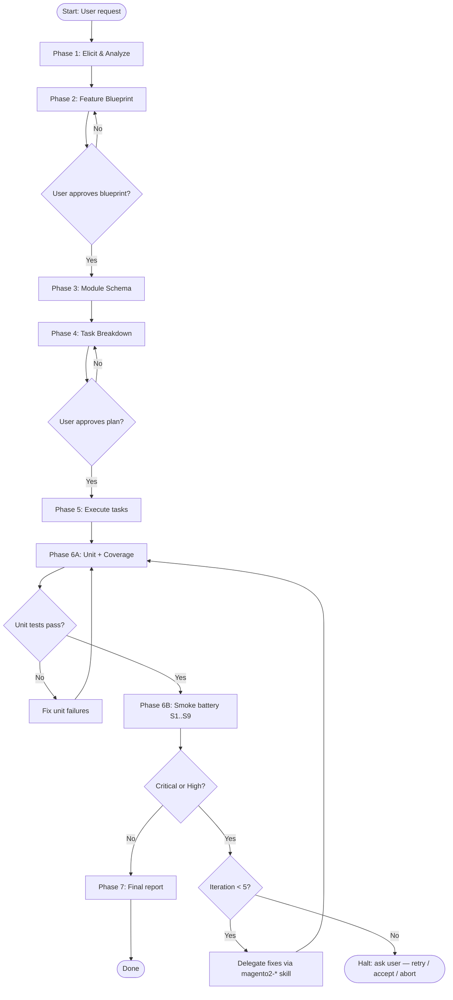

# {Feature Name} — Execution Plan

Date: {YYYY-MM-DD}
Status: Awaiting Approval
Blueprint: `.docs/{FeatureName}/blueprint.md`
Skill versions:

- magento2-feature-implement@2.7.0
- magento2-context@1.6.0

---

## Implementation Flow



---

## Task Dependency Graph

```mermaid
graph LR
    M1[M1: Create {Vendor}_{ModuleA}] --> R1[R1: Review {Vendor}_{ModuleA}]
    R1 --> M2[M2: Create {Vendor}_{ModuleB}]
    M2 --> R2[R2: Review {Vendor}_{ModuleB}]
    R1 --> T1[T1: Tests {ModuleA}]
    R2 --> T2[T2: Tests {ModuleB}]
    T1 --> V1[V1: Validate all]
    T2 --> V1
    V1 --> D1[D1: Deploy]
    D1 --> S1[S1: Baseline & probe]
    S1 --> S2[S2: REST scenarios]
    S2 --> S3[S3: Admin login]
    S3 --> S4[S4: Stores Config]
    S4 --> S5[S5: Admin grids]
    S5 --> S6[S6: New routes]
    S6 --> S7[S7: Customer flows]
    S7 --> S8[S8: exception.log diff]
    S8 --> S9{S9: Critical/High?}
    S9 -- No --> P1[P1: Final report]
    S9 -- Yes / iter<5 --> FIX[Fix via magento2-* skill]
    FIX --> D1
    S9 -- Yes / iter==5 --> HALT([Halt: ask user])
```

<!-- Expand or replace with the actual task graph for this feature. -->

---

## Module Schema

<!-- Paste the Mermaid module dependency diagram from Phase 3 here. -->

```mermaid
graph TD
    A[{Vendor}_{ModuleA}<br/>surfaces: core, persistence, service_contracts] --> B[{Vendor}_{ModuleB}<br/>surfaces: core, rest_api]
    A --> C[{Vendor}_{ModuleC}<br/>surfaces: core, admin_ui]
```

---

## Current State

<!-- Mark each task [x] immediately after it completes, before starting the next task, per
SKILL.md Phase 5 "Per-task completion protocol". This section drives resume — an unchecked
completed task makes a resumed run redo work. -->

- [ ] M1: Create `{Vendor}_{ModuleA}`
- [ ] R1: Review `{Vendor}_{ModuleA}`
- [ ] M2: Create `{Vendor}_{ModuleB}`
- [ ] R2: Review `{Vendor}_{ModuleB}`
- [ ] X1: Modify `{Vendor}_{ExistingModule}`
- [ ] R3: Review `{Vendor}_{ExistingModule}`
- [ ] T1: Unit Tests — `{Vendor}_{ModuleA}`
- [ ] T2: Unit Tests — `{Vendor}_{ModuleB}`
- [ ] V1: Validate All
- [ ] D1: Deploy
- [ ] S1: Smoke baseline & probe (Phase 6B)
- [ ] S2: Smoke — REST API scenarios
- [ ] S3: Smoke — Admin login
- [ ] S4: Smoke — Stores → Configuration walk
- [ ] S5: Smoke — Admin grids (Customers, Catalog Products, Sales Orders + new)
- [ ] S6: Smoke — New / changed routes
- [ ] S7: Smoke — Customer storefront flows
- [ ] S8: Smoke — exception.log diff
- [ ] S9: Smoke — Triage & report
- [ ] P1: Final Report

---

## Smoke Iterations

Count: 0 / 5
Last run: —
Outcome: —

<!-- Maintained by the skill during Phase 6B. Increment Count BEFORE each Phase 6 entry. -->

---

## Task List

<!-- One task record per task. Copy and expand the template below for each task. -->

---

### M1: Create `{Vendor}_{ModuleA}`

Type: Create Module
Target: `{ctx.magento_root}/app/code/{Vendor}/{ModuleA}`
Depends on: none
Skill: `magento2-module-create`
Estimate: M

Description:
Create the core domain module. Surfaces: `core`, `persistence`, `service_contracts`.
Entities: `{EntityName}`. Repository: `{Entity}RepositoryInterface`.

Included changes:
- `registration.php` — module registration
- `etc/module.xml` — module declaration
- `Api/{Entity}RepositoryInterface.php` — public repository contract
- `Model/{Entity}.php` + `Model/ResourceModel/{Entity}.php` — entity and resource model
- `etc/db_schema.xml` — schema for `{vendor_lower}_{module}_{entity}` table

Risks:
- None identified at this stage; surfaces constrained to core + persistence.

Acceptance criteria:
- All files pass `php -l` and `xmllint`
- `composer validate` passes
- `magento2-module-review` shows no Critical or High findings
- Unit tests scaffold created in `Test/Unit/`

---

### R1: Review `{Vendor}_{ModuleA}`

Type: Review
Target: `{ctx.magento_root}/app/code/{Vendor}/{ModuleA}`
Depends on: M1
Skill: `magento2-module-review`
Estimate: S

Description:
Full review of `{Vendor}_{ModuleA}` across all 12 categories.

Included changes:
- Fixes applied inline to files identified as Critical or High by the review.

Risks:
- Review may surface architectural issues requiring scope changes; escalate to user if so.

Acceptance criteria:
- No Critical or High findings
- Medium findings documented in final report
- All 12 checklist categories at Pass or Review

---

### M2: Create `{Vendor}_{ModuleB}`

Type: Create Module
Target: `{ctx.magento_root}/app/code/{Vendor}/{ModuleB}`
Depends on: R1
Skill: `magento2-module-create`
Estimate: M

Description:
Create the {surface} module. Surfaces: `core`, `{surface}`.

Acceptance criteria:
- Depends on `{Vendor}_{ModuleA}` declared in `composer.json` and `etc/module.xml`
- All files pass static checks

---

### R2: Review `{Vendor}_{ModuleB}`

Type: Review
Target: `{ctx.magento_root}/app/code/{Vendor}/{ModuleB}`
Depends on: M2
Skill: `magento2-module-review`
Estimate: S

Description:
Full review of `{Vendor}_{ModuleB}`.

Acceptance criteria:
- No Critical or High findings

---

### X1: Modify `{Vendor}_{ExistingModule}`

Type: Modify Module
Target: `{ctx.magento_root}/app/code/{Vendor}/{ExistingModule}`
Depends on: R1
Skill: manual
Estimate: S

Description:
Add observer for event `{event_name}` dispatched by `{Vendor}_{ModuleA}`.
Files added: `Observer/{ObserverName}.php`, `etc/events.xml`.

Acceptance criteria:
- Observer class passes `php -l`
- `etc/events.xml` passes `xmllint`
- No other files modified

---

### T1: Unit Tests — `{Vendor}_{ModuleA}`

Type: Test
Target: `{ctx.magento_root}/app/code/{Vendor}/{ModuleA}/Test/Unit/`
Depends on: R1
Skill: manual
Estimate: M

Description:
Write unit tests for `Service/{Name}Service.php` and `Model/{Entity}Repository.php`.
Target: ≥ 80% coverage for `Api/`, `Service/`, `Model/`.

Acceptance criteria:
- `{runner} vendor/bin/phpunit -c dev/tests/unit/phpunit.xml.dist app/code/{Vendor}/{ModuleA}/Test/Unit` passes with zero failures
- Coverage ≥ 80% confirmed via Phase 6 coverage run

---

### T2: Unit Tests — `{Vendor}_{ModuleB}`

Type: Test
Target: `{ctx.magento_root}/app/code/{Vendor}/{ModuleB}/Test/Unit/`
Depends on: R2
Skill: manual
Estimate: S

Description:
Write unit tests for any service or model classes in `{Vendor}_{ModuleB}`.

Acceptance criteria:
- `{runner} vendor/bin/phpunit -c dev/tests/unit/phpunit.xml.dist app/code/{Vendor}/{ModuleB}/Test/Unit` passes with zero failures

---

### V1: Validate All

Type: Validate
Target: all {Vendor} modules
Depends on: T1, T2
Skill: `magento2-module-review`
Estimate: S

Description:
Run the full quality gate: PHPCS, PHPMD, PHPStan level 8, and PHPUnit across all {Vendor} modules.

Acceptance criteria:
- PHPCS: zero violations
- PHPMD: zero violations
- PHPStan level 8: zero errors
- PHPUnit: zero failures, zero errors

---

### D1: Deploy

Type: Deploy
Target: all new and modified modules
Depends on: V1
Skill: `magento2-deploy`
Estimate: S

Description:
Enable modules, run `setup:upgrade`, `setup:di:compile`, and `cache:flush`.
Run `setup:db-declaration:generate-whitelist` for each module with a persistence surface.

Acceptance criteria:
- All modules enabled and listed in `bin/magento module:status`
- No compilation errors
- Admin panel accessible

---

### S1: Smoke — Baseline & Probe

Type: Smoke
Target: `.docs/{FeatureName}/smoke/baseline.txt`
Depends on: D1
Skill: `magento2-feature-implement` (uses `scripts/smoke-baseline.sh` + environment probe per
`references/smoke-runner.md`)
Estimate: S

Description:
Snapshot `var/log/exception.log` byte offset; probe Base URL, admin URL, credentials, HTTP
client, headless browser; apply production guard. Halt 6B cleanly if a precondition is missing.

Acceptance criteria:
- `baseline.txt` written with `file`, `size_bytes`, `sha256_of_last_4096`, `captured_at`.
- All probe results recorded; missing tools tagged as limitations rather than silent skips.
- Production guard cleared or CLAUDE.md override confirmed.

---

### S2: Smoke — REST API Scenarios

Type: Smoke
Target: `.docs/{FeatureName}/smoke/scenarios.md` + `smoke/raw/S2/*.txt`
Depends on: S1
Skill: `magento2-feature-implement` (curl / php-curl driven; per `references/smoke-runner.md` §2)
Estimate: M (skip if feature exposes no REST surface)

Description:
For every REST endpoint declared in blueprint §6: happy path, missing-auth, wrong-ACL, validation
error, not-found (for GET/PUT/DELETE), pagination (for list). Document scenarios; execute;
record Actual + Pass per row.

Acceptance criteria:
- Every endpoint has ≥ 5 scenarios.
- Every scenario row has Actual + Pass filled.
- All scenarios pass OR every failure is logged as a finding with severity.

---

### S3: Smoke — Admin Login

Type: Smoke
Target: `.docs/{FeatureName}/smoke/screenshots/run-{N}/admin-login.png`
Depends on: S1
Skill: `magento2-feature-implement` (uses `scripts/smoke-browser.mjs admin-login`)
Estimate: S

Acceptance criteria:
- Admin dashboard renders after submitting credentials.
- No console errors of type `error` or `pageerror`.

---

### S4: Smoke — Stores → Configuration Walk

Type: Smoke
Target: per-section results in `run-{N}.md`
Depends on: S3
Skill: `magento2-feature-implement` (uses `scripts/smoke-browser.mjs stores-config-walk`)
Estimate: M (skip if feature adds/changes no admin config)

Acceptance criteria:
- Every new/changed section in blueprint §5 loads.
- One safe field per section changed and reverted; Save Config returns success.
- No exception.

---

### S5: Smoke — Admin Grids

Type: Smoke
Target: per-grid results in `run-{N}.md`
Depends on: S3
Skill: `magento2-feature-implement` (uses `scripts/smoke-browser.mjs grid`)
Estimate: S

Acceptance criteria:
- Customers, Catalog → Products, Sales → Orders all render.
- For each: one filter applied and cleared; rows render before and after.
- Any new grid added by the feature also passes.

---

### S6: Smoke — New / Changed Routes

Type: Smoke
Target: per-route results + screenshots in `run-{N}.md`
Depends on: S3
Skill: `magento2-feature-implement` (uses `scripts/smoke-browser.mjs visit`)
Estimate: M

Acceptance criteria:
- Every new/modified controller route renders HTTP 2xx.
- Primary CTA clicks successfully on each.
- No console errors.

---

### S7: Smoke — Customer Storefront Flows

Type: Smoke
Target: per-step results in `run-{N}.md`
Depends on: S1
Skill: `magento2-feature-implement` (uses `scripts/smoke-browser.mjs customer-flow`)
Estimate: M

Acceptance criteria:
- Throwaway customer (`smoke+{uuid}@example.test`) registers, logs out, logs back in.
- Every default My Account tab + any new tabs render without console errors.
- Throwaway customer deleted in S9 cleanup.

---

### S8: Smoke — Exception.log Diff

Type: Smoke
Target: `.docs/{FeatureName}/smoke/raw/S8/exception-diff.log`
Depends on: S2, S3, S4, S5, S6, S7
Skill: `magento2-feature-implement` (uses `scripts/smoke-tail-since.sh`)
Estimate: S

Acceptance criteria:
- Diff against S1 baseline is empty, OR every non-empty group is recorded as a finding.
- Allowlisted patterns from CLAUDE.md demoted to Medium rather than silently ignored.

---

### S9: Smoke — Triage & Report

Type: Smoke
Target: `.docs/{FeatureName}/smoke/run-{N}.md` + `findings.md` + updated `plan.md`
Depends on: S8
Skill: `magento2-feature-implement` (uses `templates/smoke-run-report.md` + `templates/smoke-findings.md`)
Estimate: S

Description:
Classify every recorded failure; assign/reuse stable finding IDs; write iteration report;
update consolidated findings; decide PASS / FAIL / HALT; if FAIL, delegate fixes per
`references/smoke-test-guide.md` §Fix Routing and re-enter Phase 6 from 6A.

Acceptance criteria:
- Iteration report written with all sections from `templates/smoke-run-report.md`.
- `findings.md` updated; prior IDs preserved; resolved findings marked.
- `plan.md` `## Smoke Iterations` block updated with Count, Last run, Outcome.
- Cleanup performed (admin config reverted, throwaway customer deleted, SMOKE-* SKUs removed).

---

### P1: Final Report

Type: Report
Target: `.docs/{FeatureName}/report.md`
Depends on: S9 (with PASS decision, or user `accept-known-issues` after halt)
Skill: manual
Estimate: S

Description:
Produce the final implementation report per `references/final-report-format.md`.
Generate optional HTML guides (developer-guide.html, user-guide.html) if applicable.

Included changes:
- `.docs/{FeatureName}/report.md` — implementation report
- `.docs/{FeatureName}/guides/developer-guide.html` — if complex integration points exist
- `.docs/{FeatureName}/user-docs/user-guide.html` — if admin workflows require documentation

Risks:
- None; documentation only.

Acceptance criteria:
- All 10 sections present (§10 Smoke Test Results included).
- Deviations from blueprint documented.
- Tradeoffs section populated.
- Report saved to `.docs/{FeatureName}/report.md`.

---

## Summary

| Metric | Value |
|--------|-------|
| Total tasks | {N} |
| Modules to create | {N} |
| Modules to modify | {N} |
| Estimated effort | {S+M+L total} |

---

**Plan ready for approval.**
Reply **"proceed"** to begin implementation, or describe any changes to the plan.
